**

**static** 修饰局部变量，作用域==局部，生命周期=\=整个程序的

**static** 修饰全局变量，作用域==当前文件（同一项目下其他文件不可见），生命周期=\=整个程序的

**static**修饰类数据成员，会导致仅有一个该成员的副本被类的所有对象共享。

**extern**用于共享程序之间的全局变量（加上static就不能共享了）或者函数。

要求：在一个文件中声明并定义了全局变量或函数

在另一个文件中用extern进行了声明

```c++
1.cpp（main）
#include <iostream>

int count ;
extern void write_extern();

int main()
{
   count = 5;
   write_extern();
}    

2.cpp（func)
#include <iostream>


void write_extern(void)
{
	extern int count;
   	std::cout << "Count is " << count << std::endl;
}


1.cpp
extern const int Length=12;//变量定义
2.cpp
#include <iostream>
int main()
{
	using std::cout;
    extern const int Length;//extern 变量声明，关键是类型必须写完整，const int
    return 0;
}
```

cout 缓冲标准输出流 cout<<

cin 缓冲标准输入流 cin>>

cerr  非缓冲标准错误流  cerr<<

clog 缓冲标准日志流  clog<<

继承类能够访问基类的private成员不是说直接用成员运算符进行访问，而是通过成员函数进行访问

若继承时用的访问修饰符是private，显然都变为private，都无法访问

首选public继承

有public, protected, private三种继承方式，它们相应地改变了基类成员的访问属性。

- 1.**public 继承：**基类 public 成员，protected 成员，private 成员的访问属性在派生类中分别变成：public, protected, private
- 2.**protected 继承：**基类 public 成员，protected 成员，private 成员的访问属性在派生类中分别变成：protected, protected, private
- 3.**private 继承：**基类 public 成员，protected 成员，private 成员的访问属性在派生类中分别变成：private, private, private

但无论哪种继承方式，上面两点都没有改变：

- 1.private 成员只能被本类成员（类内）和友元访问，不能被派生类访问；
- 2.protected 成员可以被派生类访问。

在为构造函数指定默认参数时，只需要在构造函数的声明语句中指定，不需要再在构造函数的定义语句中指定

指定了默认参数，在对象声明时，可以不加（）

1. 应该在声明构造函数时指定默认值，而不能只在定义构造函数时指定默认值。

   也就是在类里面指定

2. 程序第5行在声明构造函数时，形参名可以省略。

   比如Box(11,12,13)

3. 如果构造函数的全部参数都指定了默认值，则在定义对象时可以给一个或几个实参，也可以不给出实参。

   这个时候，如果实参数目不够，只能按照顺序进行赋值

4. 在一个类中定义了全部是默认参数的构造函数后，不能再定义重载构造函数。

精简版的构造函数

Box::Box(int x,y,z):a(x),b(y),c(z)

{
}


如果没有自己定义拷贝构造函数，进行类似的赋值操作

Box b1(12);

Box b2 = b1;

最终&b2!=&b1是两个对象，但是Box的构造函数只被执行了一次

**拷贝构造函数**是一种特殊的构造函数，它在创建对象时，是使用同一类中之前创建的对象来初始化新创建的对象。拷贝构造函数通常用于：

- 通过使用另一个同类型的对象来初始化新创建的对象。
- 复制对象把它作为参数传递给函数。
- 复制对象，并从函数返回这个对象。

如果在类中没有定义拷贝构造函数，编译器会自行定义一个。如果类带有指针变量，并有动态内存分配，则它必须有一个拷贝构造函数。拷贝构造函数的最常见形式如下：

```cpp
#include <iostream>

using namespace std;

class Line
{
public:
    int getLength(void);
    Line(int len);             // 简单的构造函数
    Line(const Line& obj);  // 拷贝构造函数
    ~Line();                     // 析构函数

private:
    int* ptr;
};

// 成员函数定义，包括构造函数
Line::Line(int len)
{
    cout << "Normal constructor allocating ptr" << endl;
    // 为指针分配内存
    ptr = new int;
    *ptr = len;
}

Line::Line(const Line& obj)
{
    cout << "Copy constructor allocating ptr." << endl;
    ptr = new int;
    *ptr = *obj.ptr; // copy the value
}

Line::~Line(void)
{
    cout << "Freeing memory!" << endl;
    delete ptr;
}
int Line::getLength(void)
{
    return *ptr;
}

void display(Line obj)
{
    cout << "Length of line : " << obj.getLength() << endl;
}

// 程序的主函数
int main()
{
    Line line(10);

    display(line);

    return 0;
}
执行结果为
Normal constructor allocating ptr
Copy constructor allocating ptr.
Length of line : 10
Freeing memory!
Freeing memory!
```

为什么调用了一次拷贝构造函数？因为在调用display时，参数按值传递，产生了一个临时的变量，所以调用了拷贝构造函数

如果改为按引用传递

```cpp
#include <iostream>

using namespace std;

class Line
{
public:
    int getLength(void);
    Line(int len);             // 简单的构造函数
    Line(const Line& obj);  // 拷贝构造函数
    ~Line();                     // 析构函数

private:
    int* ptr;
};

// 成员函数定义，包括构造函数
Line::Line(int len)
{
    cout << "Normal constructor allocating ptr" << endl;
    // 为指针分配内存
    ptr = new int;
    *ptr = len;
}

Line::Line(const Line& obj)
{
    cout << "Copy constructor allocating ptr." << endl;
    ptr = new int;
    *ptr = *obj.ptr; // copy the value
}

Line::~Line(void)
{
    cout << "Freeing memory!" << endl;
    delete ptr;
}
int Line::getLength(void)
{
    return *ptr;
}

void display(Line &obj)
{
    cout << "Length of line : " << obj.getLength() << endl;
}

// 程序的主函数
int main()
{
    Line line(10);

    display(line);

    return 0;
}
Normal constructor allocating ptr
Length of line : 10
Freeing memory!
```

note:在类中有int *ptr，也就是ptr的定义

但是没有分配内存，所以要在构造函数中ptr = new int

调用拷贝构造函数时，也有了变量的定义，没有分配内存，需要分配内存和赋值


类的友元函数是定义在类外部，但有权访问类的所有私有（private）成员和保护（protected）成员。尽管友元函数的原型有在类的定义中出现过，但是友元函数并不是成员函数。

友元可以是一个函数，该函数被称为友元函数；友元也可以是一个类，该类被称为友元类，在这种情况下，整个类及其所有成员都是友元。

如果要声明函数为一个类的友元，需要在类定义中该函数原型前使用关键字 **friend**

友元函数/友元类

```cpp
class Test {
	int inner;
public:
	void set(int x);
	void show();
	friend void modify(Test &obj,int x);
};
```

友元函数能够访问obj中的所有成员，但是如果要进行自定义的修改，还是得按照&传递参数


在C++中可以使用**内联函数，**其目的是为了提高函数的执行效率**，**通常与类一起使用。如果一个函数是内联的，那么在编译时，编译器会把该函数的代码副本放置在每个调用该函数的地方。

如果想把一个函数定义为内联函数，则需要在函数名前面放置关键字 **inline**，在调用函数之前需要对函数进行定义。如果已定义的函数多于一行，编译器会忽略 inline 限定符。


在类定义中的定义的函数都是内联函数，即使没有使用 **inline** 说明符。

内联函数：从写的角度来说，看起来或者写的代码变少了，虽然在编译时会像文本替换一样进行处理，但coder写的工作量确实少了

从exe程序的角度来说，相比于函数调用，这种方式会导致程序变大，但是省去了函数调用过程，会节省时间

另外需要注意的是，调用内联函数的语句前必须已经出现内联函数的定义（即整个函数体），而不能只出现内联函数的声明。

在 C++ 中，每一个对象都能通过 **this** 指针来访问自己的地址。**this** 指针是***所有成员函数的隐含参数***。因此，在成员函数内部，它可以用来指向调用对象。

友元函数没有 **this** 指针，因为友元不是类的成员。只有成员函数才有 **this** 指针。

简单来说，就是将一个类的对象作为参数，传入到另一个类的对象的成员函数中，this指代“另一个类的对象”

指向类的指针，在进行初始化时，如果用的是new而不是&，也会执行构造函数。和一般的变量赋值和对象声明没有区别


静态成员

用static

特性：


utf-8下

中文字符占用两个字节

```c
char ch[2] = "我";
cout<<ch;
#数组溢出
char ch[3] = "我";
cout<<ch;
---------
我

```

malloc之后的需要进行初始化，否则是之前这个地址的数据（数据放在堆里面）

构造函数默认不继承，如果需要继承

> using classname::classname

```cpp
	cout<<"hello "<<endl;
	char str = cin.get();
	cout<<str;
```

clike 头文件名，“.h”;cpplike no“.h”但是需要名称空间编译指令to make 头文件中的definitions visible


using 编译指令

suppose:pro1 中有func，pro2也有func，so当调用时，用哪个？

将pro中的定义放到namespace std里面，用上`using namespace std` 就使用pro1中的func

disadvantage:如果pro1，pro2都有func2，而要使用pro2中的，前面用了`using namespace std`会使pro2-func2 not  visible，so `using std::func` better

声明区域，潜在作用域，作用域


```cpp
#include <iostream>
namespace Mine {
	using std::endl;
	using std::cout;
	using std::cin;
}
int main()
{
	using namespace Mine;
	cout << "aaa" << endl;
	return 0;
}
```


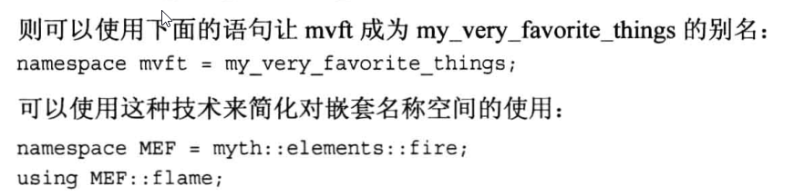


***头文件中最好不要有using 编译指令，尤其是在头文件中自定义了namespace***

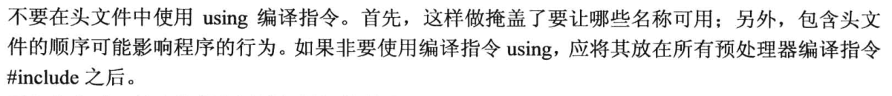


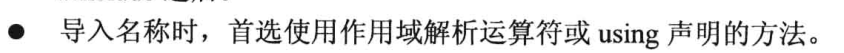

对于不常使用的，作用域解析运算符

经常使用的，using declaration


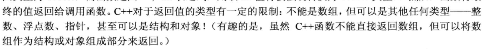


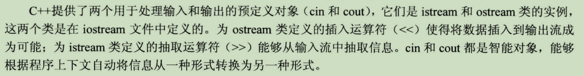


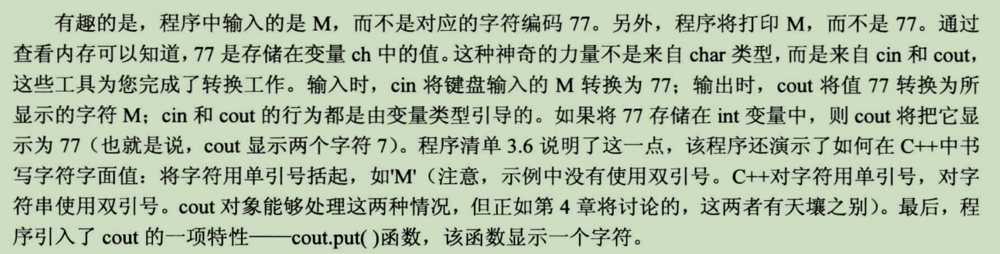

cout.put(const char*)  cin,get(char *)

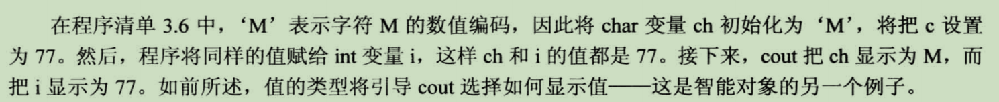

endl  // endl是用来 完成换行并刷新缓冲区的

flush  // flush是用来 直接刷新缓冲区的

ends  // ends 则在输入后加上一个空字符，然后再刷新缓冲区

cout << unitbuf// 这里unitbuf 不执行任何动作，而是设置这个cout输出流 在接下来的每次操作之后都进行刷新缓冲区

cout << nounitbuf// 这里nounitbuf则是让cout 回到正常的缓冲方式


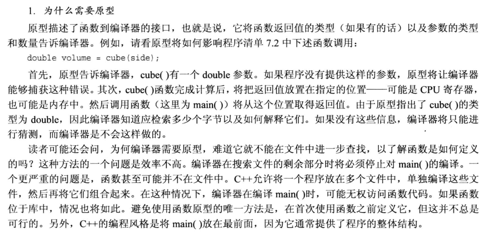


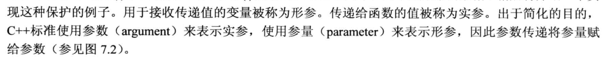


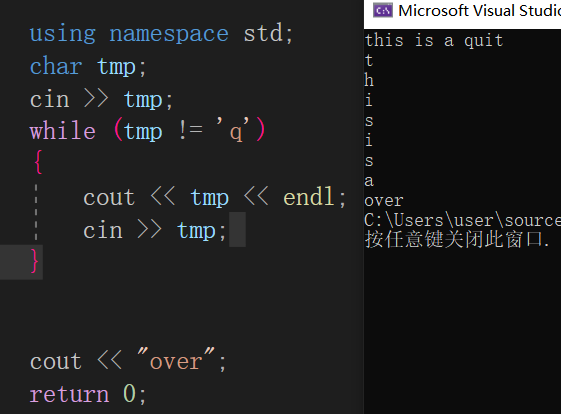

cin ：first wait for the input until ‘enter’ 。second insert input into istream 。third read a char or chars from the stream

cin自动忽略换行符

ch=cin.get() // cin.get(ch)不忽略换行符


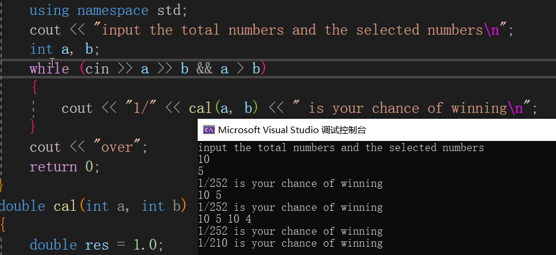


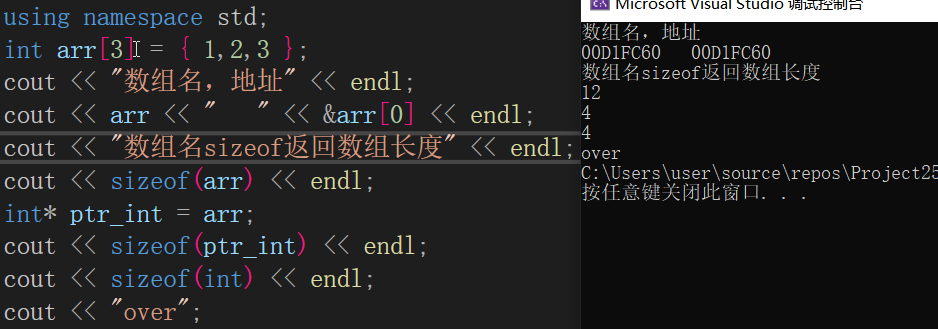


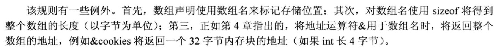


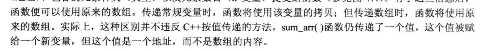


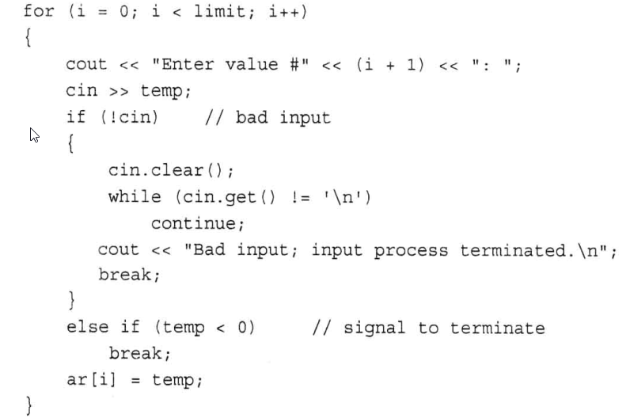

当输入出现类型不匹配时，cin（四种状态标识)的状态变为failbit，此时需要执行两个操作1.将状态重置2.取出缓冲流中的字符

>goodbit 无错误 
>Eofbit 已到达文件尾 
>failbit 非致命的输入/输出错误，可挽回 
>badbit　致命的输入/输出错误,无法挽回 若在输入输出类里.需要加ios::标识符号

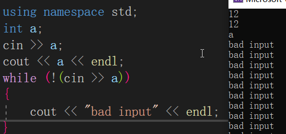

cin的标识符一直为failbit

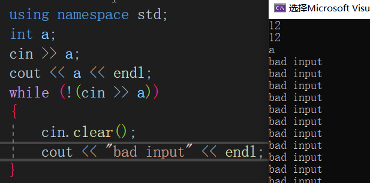

虽然clear了，进入循环后标识符改为了goodbit，但是缓冲流中仍然是a，不断的读取，失败，进入循环，再次读取。

现在要做的就是清空缓冲流。

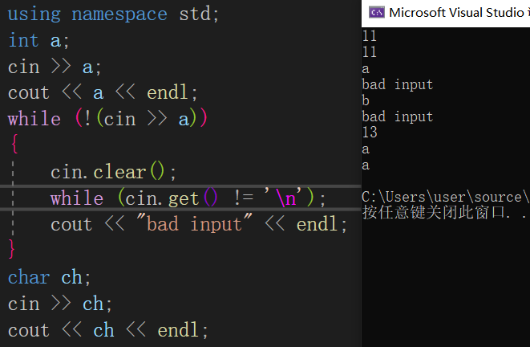

读取出来即可


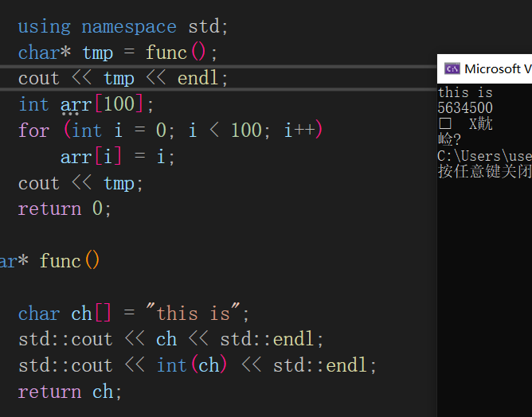

返回局部变量（地址）是危险的。

```cpp
#include <iostream>
#include <cstring>
char* func();
const char* func2();
int main()
{
	using namespace std;
	char* tmp = func();
	cout << tmp << endl;
	int arr[100];
	for (int i = 0; i < 100; i++)
		arr[i] = i;
	cout << tmp;
	const char* a = func2();
	cout << endl << a;
    //delete []a;    				invalid
	return 0;
}
const char* func2()
{
	const char* ch = new char(strlen("this is") + 1);
	ch = "this is";
	return ch;
}
char* func()
{
	char ch[] = "this is";
	std::cout << ch << std::endl;
	std::cout << int(ch) << std::endl;
	return ch;
}
this is
9893540
   D鶘
韡
this is
```

in func2，“this is”是字符串常量，返回地址，是const char *类型的，不能赋给char *类型的，所以声明为const char *ch = new char(length+1)，返回值也是const char *。在main函数中，用来接收的指针是const char *。delete是个错误，因为a是const char   * 类型的局部变量，1.是通过声明得到的，而不是new来的2.对于局部变量，退出代码块时自然释放内存3.对于常量，no delete，只有等程序退出时，才释放，并且这个地址也不是new来的。

>但如果是像const char* str这种指针，则不需要手动释放内存，这是因为const char* str定义的是一个指向常量的指针。
>
>如果str是局部变量，这字符串会随着变量所在函数的退出而自动释放；如果str是全局变量，则程序退出时才自动释放。

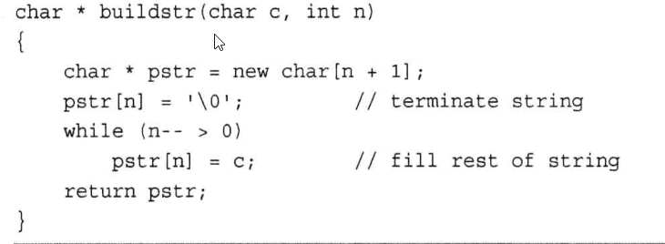

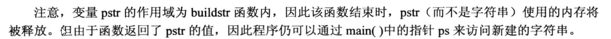


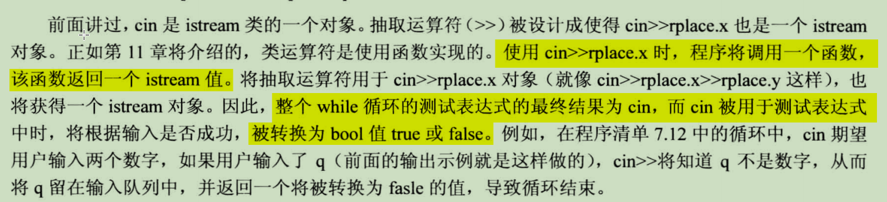

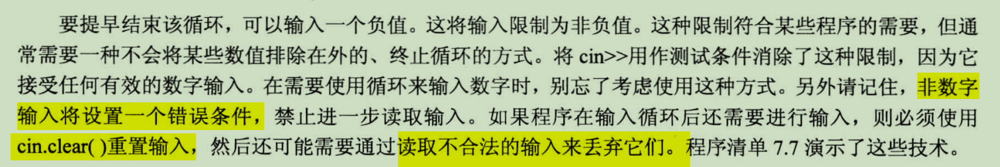


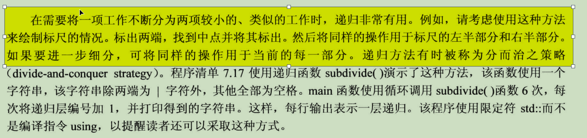


函数名即为函数地址

函数原型：double func(int ,char)

addr = func

函数指针声明：double (*fptr) (int ,char);

函数指针赋值：fptr = func

函数指针调用：double x = (*fptr)(4,'c')

传递参数时，需要单独传func的参数


```cpp
void f1(applicant*a);
const char *f2(const applicant *a1,const applicant *a2);
void (*p1)(applicant*a) = f1;
const char *(*p2)(const applicant *a1,const applicant *a2);
void (*ap[5])(applicant*a);
const char *(*pa[10])(const applicant *a1,const applicant *a2);
```

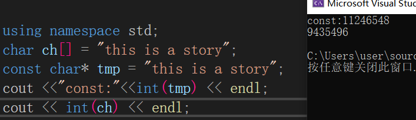


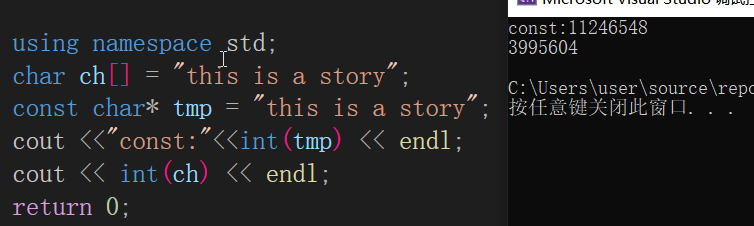


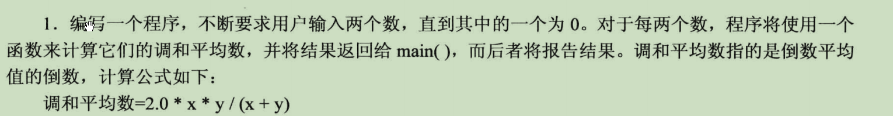

```cpp
	double a, b;
	while (1)
	{
		cin >> a >> b;//获取输入
		if (!cin)//字符格式检查
		{
			cin.clear();
			while (cin.get() != '\n');
			cout << "invalid input, retry\n";
			continue;//跳回读取字符
		}
		if (a == 0 || b == 0)
			break;
		cout << func(a, b) << endl;
	}
```

```cpp
int input(double arr[])
{	
	using namespace std;
	int i = 0;
	cout << "anytime input q to quit\n";
	for (; i<SIZE && cin >> arr[i]; i++);
	if (!cin)
	{
		cin.clear();
		while (cin.get() != '\n');
	}
	return i;
}
```


cin以空白为结尾。

如果读取的是字符，空白会被替换为'\0'，不会保留在缓冲区中

如果是数字，还会有'\n'

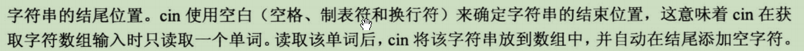


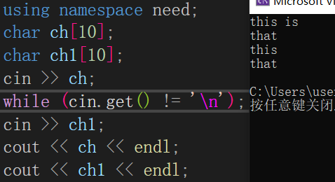

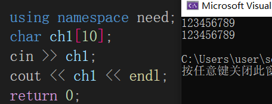

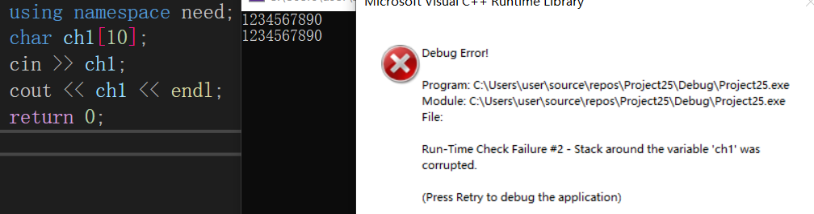

用cin向字符数组中写入时，写入的字符如果超出了，程序会停止

对于未读取的换行符，还得(cin>>var).get()

cin.getline(char*,int,char *)最后的终止字符会被读入，但是会被替换为'\0'的空字符。同时受到int的个数限制。如果一个字符都没有读取，那么第一个参数的第一个元素是\0


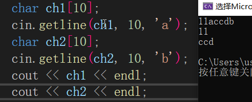

终止的字符不会被保留在缓冲区


与cin.getline(list)读取终止字符并替换为空字符不同，cin.get(char*,int,char *)遇到终止字符（默认为换行符）不会读取，那么当终止字符相同时，假设为换行符，那么后面的都是空字符串。

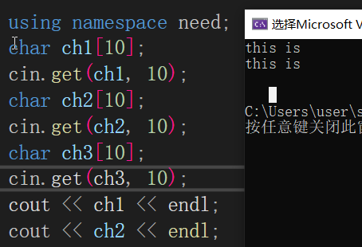


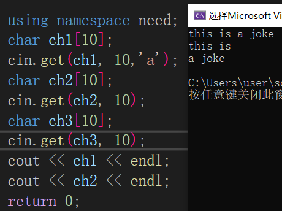


'a'并没有被读取

拼接：cin.get()返回一个istream的cin对象，必须把终止字符读出来。

`cin.get(array,number).get()`

cin.get()相比于cin.getline()的优点在于，终止字符不会被读入，而读取结束的条件可能是数组满了或者真的读到换行符了，通过检测最后一个字符，就可以确定数组是否满了，或者说有没有读完一行的内容。

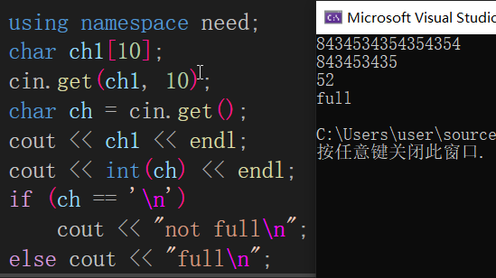


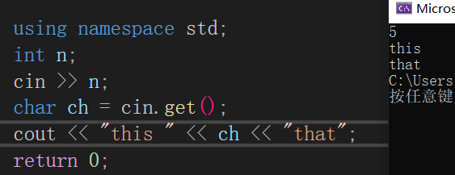

换行符被留在了缓冲队列

```cpp
#include <iostream>
#include <cstring>
const int SLEN = 30;
struct student {
	char fullname[SLEN];
	char hobby[SLEN];
	int ooplevel;
};
int getinfo(student pa[], int n)
{
	using namespace std;
	int i = 0;
	for (; i < n; i++)
	{
		cout << "input the fullname, hobby, ooplevel:\n";
		cin.getline(pa[i].fullname, SLEN, '\n');
        //para1：char*,para2:int,para3:char
        //读取的终止条件，读了n-1个字符（最后一个放入'\0'）或者遇到char；对于char，读取，但不读入
        //如果第一个字符就是char，那么最终只有'\0'
		if (pa[i].fullname[0] == 0)
			break;
		cin.getline(pa[i].hobby, SLEN, '\n');
		cin >> pa[i].ooplevel;
        //cin读取数组，换行符被留在缓冲流中，需要拿出来
		while (cin.get() != '\n');
	}
	return i;
}
void display1(student st)
{
	using namespace std;
	cout << "fullname: " << st.fullname 
		 << " hobby: " << st.hobby 
		 << " ooplevel: " << st.ooplevel << endl;
}
void display2(const student* ps)
{
	using namespace std;
	cout << "fullname: " << ps->fullname
		<< " hobby: " << ps->hobby
		<< " ooplevel: " << ps->ooplevel << endl;
}
void display3(const student pa[], int n)
{
	for (int i = 0; i < n; i++)
		display2(pa+i);
}
int main()
{
	using namespace std;
	int classsize;
	cout << "enter the class size:";
	cin >> classsize;
	while (cin.get() != '\n');
	student* ptr_stu = new student[classsize];
	int entered = getinfo(ptr_stu, classsize);
	for (int i = 0; i < entered; i++)
	{
		display1(ptr_stu[i]);
		display2(ptr_stu + i);
	}
	display3(ptr_stu, entered);
	delete[] ptr_stu;
	return 0;
}
```

```cpp
#include <stdio.h>
#include <conio.h>
int main()
{
	char ch[10] = { 0 };
	int i = 0;
	while (true&&i<9)
	{
		ch[i] = _getch();
		if (ch[i] == 13)
		{
			ch[i]=0;
			break;
		}
		i++;
	}
	for (int i = 0; i < 9;++i)
	{
		printf("%d\n", ch[i]);
	}
	printf("%s", ch);
}
```


对于本代码的说明：

1.conio.h中的_getch()函数，可以像没有缓冲一样读取键盘的输入，而不能撤销更改

2.何时能够结束输入呢？进行一步判断，然后关键是，在debug中发现回车'\r'是13，那就13。

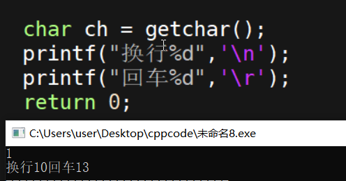


enter输入的是'\r'回车，return 

最终版获取输入且进行密码保护的code

```cpp
#include <stdio.h>
#include <conio.h>
int main()
{
	const int length = 12;
	char array[length+1] = { 0 };
	int i = 0;
	while (i<length)
	{
		array[i] = _getch();
		if (array[i] == '\r')
		{
			array[i] = 0;
			break;
		}
		else if (array[i] != '\b')
		{
			printf("*");
			i++;
		}
		else
		{
			printf("\b \b");
			i--;
		}
	}
	printf("%s", array);
}
```


在变量声明前加上const限定符后，该变量就只读

浮点数：基准值，缩放因子；float，double，long double的区别：有效数位，允许的指数最小范围

```cpp
#include <iostream>
#include <string>
#include "mine.h"
void input(int& a,const char*ch)
{
	using namespace need;
	while (1)
	{
		cout << "input:";
		cin >> a;
		if (!cin)
		{
			cin.clear();
			while (cin.get() != '\n');
			cout << ch<<" in the right form\n";
		}
		else break;
	}
}
int main()
{
	using namespace need;
	const double rate = 60;
	int a, b, c;
	input(a,"degree");
	input(b,"minute");
	input(c,"second");
	cout << a << "," << b << "," << c << "==" << a + b / rate + c / rate / rate;
	return 0;
}
```

Jack Brown play 30Jack Brown
play
30
Mary Smith
swim
20

nobody

20


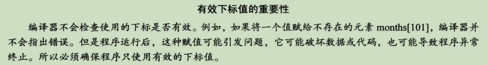

编译器不会检查下标越界

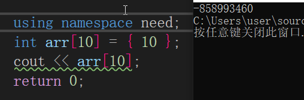

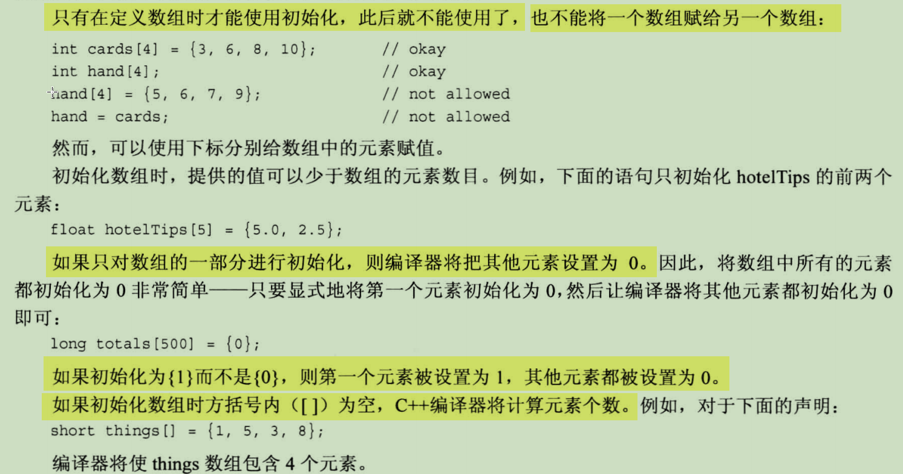


vector模板类，动态数组，头文件vector，名称空间std，指出元素的类型，指出元素的个数

相当于把对动态数组的操作写到一个类中，用起来不用造轮子，但是效率偏低

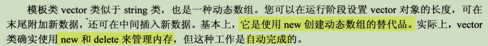

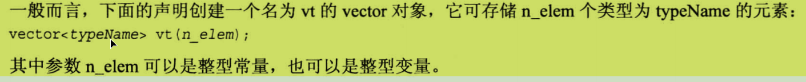

注意，可以是常量或变量

```cpp
	vector<int> vc(10);
	int i = 10;
	vector<double> vt(i);
```


模板类array

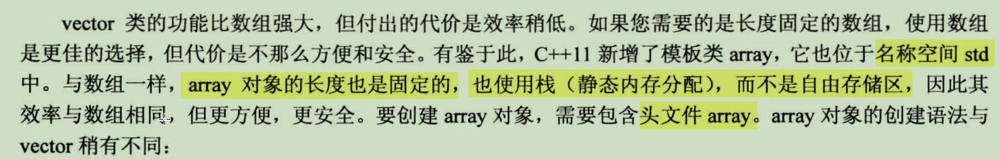

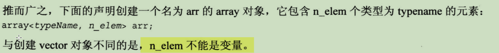


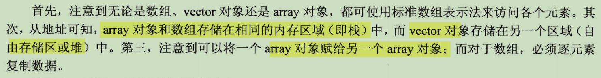


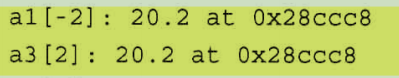

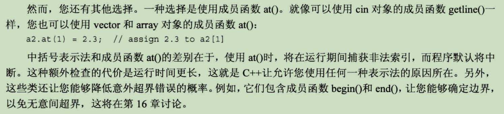

vector类中封装了一些检查数组上下界的函数，代价是使用后运行时间延长


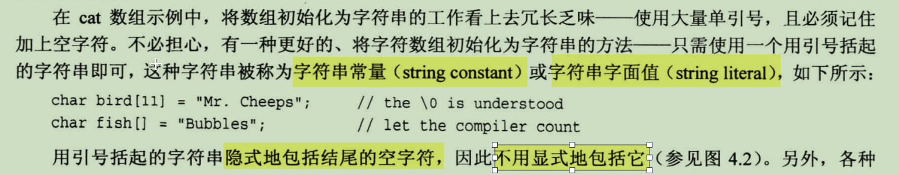


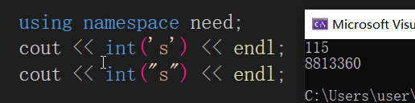

字符常量's'的本质是编码，字符串常量的本质是静态存储区的一个地址，字符串的首地址


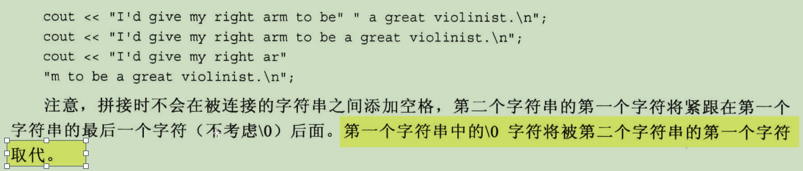


```cpp
char ch[5];
cin>>ch;
//可以完成类似数组初始化的操作char ch[5]="this"，但是输入的字符数<=sizeof（ch）/sizeof（ch[0])-1
```


string类


结构，用户自定义的数据类型；结构声明定义数据类型的属性；根据数据类型创建结构变量

如整形，整形变量


c++中，声明结构变量时，可以不要关键字struct，而仅将标识符视为类型


结构可以直接进行赋值


枚举，也是用户自己定义的数据类型

所以需要定义，需要创建变量


enum是关键字，类似struct；spectrum是标识符，后面的是符号常量，枚举量，默认从0递增，也可以指定。


声明枚举类型后，创建变量


赋值

1. 最正统的方法是用枚举量进行赋值，band = red;即只能将定义枚举时用到的枚举量赋给枚举的变量
2. band = int;结果是未知的，一是不知道范围超过了没有，而是int不能提升为枚举，枚举可以提升为int
3. 进而，band = 10；band++；band = red+blue；都是不合法的
4. band=red+blue，枚举到int，而结果为int，不能赋值给枚举变量
5. 但是int i = band+10；是可行的，因为枚举可以提升为int
6. 如果int值有效，可以typecast，band = spectrum（3）equals to band = green but 有危险
7. 
8. 指定枚举量的值
   1. enum name {var1=3，var2，var3}此时，未指定，默认自增
   2. 同时，枚举量的值可以相等


指针变量可以进行赋值，而数组名的值是不能改变的，数组名虽然存储的也是地址，但更像数组这块内存空间的标识符。

如果指针变量指向的是一块内存，还是不要随意改变值，否则delete[]可能出现问题，找不到首地址


new出来的数组，都没有进行初始化，里面写的还是堆中以前的东西，也没有自动设置为0，所以必须初始化


"this"是字符串的字面值，理解为const char*。cout遇到char *，会将这个地址里面的内容转成字符，打印出来，但是转换为Int *之后，cout打印这个指针，即"this"的地址


```cpp
char *ch="this";//const char* to char* , invalid
const char *ch="this";//valid
```


strncpy(char*, const char *,num)

num最好设置为length-1，然后函数自动补充'\0'

在函数中有了一个字符串，直接返回字符串的首地址是危险的，虽然返回字符串的首地址后，仍然可以用这个字符串，而且最后的空字符也还在。但是对程序而言，这块内存单元是没有被使用的，因为被变量释放了，那么这块内存单元是可以被写入的。正确的做法是，拷贝一份，

可以看到，返回后地址还是一样的，但是内容已经不一样了，说明已经被函数内部的那块内存地址已经再次写入了。

这是返回了局部变量的地址，如果非要返回，使用new，让函数结束后，这块内存单元不会被回收


ch数组名，三个元素，char*，可以作为一个字符串（new的内存单元）的首地址

delete时也要注意

```cpp
char *ch[3];
	for (int i = 0; i < 3; ++i)
		 ch[i]= get();
	for (int i = 0; i < 3; ++i)
		cout << ch[i] << endl;
	//delete[]ch;这样是说ch指向一块new的内存单元，实际不是
	for (int i = 0; i < 3; i++)
		delete[]ch[i];//每个ch[i]都指向一个new的内存单元，而且是一大块
```

自动存储


静态存储


动态存储


strcmp(char*,char *)

按照charset的编码值进行比较ASCII中先大写字母，然后小写字母。


string类中对运算符==，！=进行了重载，可以用来替代strcmp。

前提是有一个操作数为string，另一个为string或char*

延时或计时

ctime头文件中，函数clock()返回程序从开始到执行该函数，计算机CPU计时单元的计时数，类型为clock_t 即clock tick。并且定义了常量 CLOCKS_PER_SECOND

文件尾及其判断条件


遇到eof（ctrl+z）也可以用cin.clear()进行重置


有原型 istream & get(char&)所以cin.get(char)的返回值为cin，然后进行bool转换


当读取到EOF时，由于没有什么可以写入了，cin.get(char)，char的值不变，返回cin对象，bool转换后，为false

所以可以不使用cin.fail()来返回failbit，直接对cin.get(char)的结果进行判断


一个判断字符类型的库cctype，原来是ctype.h。不用造轮子了


switch


输入错误的四个后果：

- 缓冲流中的东西不会被读取
- n的值自然不变
- cin标志位被修改
- 如果进行bool转换，结果为false

# start

文件i/o。i/o都是相对内存而言，i是文件到内存，o是内存到文件

- 头文件fstream
- 名称空间std，std::ofstream
- 对象声明，ofstream name
- 与文件关联，name.open(filename)
- 文件关闭，name.close()

可以指定文件的方式

| ios::in     | 为输入(读)而打开文件         |
| ----------- | ---------------------------- |
| ios::out    | 为输出(写)而打开文件         |
| ios::ate    | 初始位置：文件尾             |
| ios::app    | 所有输出附加在文件末尾       |
| ios::trunc  | 如果文件已存在则先删除该文件 |
| ios::binary | 二进制方式                   |

这些方式是能够进行组合使用的，以“或”运算（“|”）的方式

如果不指定特殊的方式，默认打开文件写入前，对文件进行清空，很危险。

使用时，ios类位于iostream头文件中，名称空间std中。

相当于名称空间的嵌套了


ifstream的对象和cin没有啥本质区别，分别是从文件，缓冲流中将数据读入到内存，以至于方法都十分相似

ifstream object同样可以getline，并且碰到eof后，设置标志位，也用ifstream_object.clear()重置标志位

注意到可以在声明对象时加上关联文件名，因为调用了构造函数，文件名作为参数，传给了this->open(filename)

一个可能的bug

内存输出时，文件不存在，没事儿，会进行新建

```cpp
#include <iostream>
#include <fstream>
using namespace std;
int main()
{
	string filename = "data.txt";
	ofstream out(filename, ios::out);
	for (int i = 0; i < 10; i++)
		out << i << " ";
	out.close();
	return 0;
}
```


内存输入时，如果文件不存在，如何输入

```cpp
#include <iostream>
#include <fstream>
using namespace std;
int main()
{
	string filename = "data.txt";
	ifstream in;
	in.open(filename, ios::in);
	if (in.is_open())
	{
		cout << filename << " open\n";
	}
	else
		cout << filename << " open error\n";
	return 0;
}

data.txt open error
```


加上一个判断位`if (object.is_open()==false)`

```cpp
using namespace need;
	//先写入随机数，然后读取，求和，将结果输出
	srand(time(NULL));
	string filename = "data.txt";
	ofstream out(filename, ios::out);
	//3行4列的数据
	for (int j = 0; j < 3; j++)
	{
		for (int i = 0; i < 4; i++)
		{
			out << rand() << " ";
		}
		out << endl;
	}
	ifstream in(filename, ios::in);
//不一定打开成功，所以需要测试
	if (in.is_open())
	{
		cout << filename << " 打开成功\n";
		int sum = 0,i;
		while (in >> i)
			sum += i;
		if (in.fail() == true)
		{
			cout << "eof\n";
			in.clear();
		}
		cout << "res = " << sum;
	}
	else
	{
		cout << filename << " 打开失败\n";
	}

	return 0;
data.txt 打开成功
eof
res = 127816
```

这个程序也有个问题，读取用的是`while(in>>i);`

可能的问题是文件中有非int与空白字符的字符，读取结束，而后面还有数据，怎么办呢？

现在，退出有eof，不匹配两种情况逐个检测

```cpp
while(1)
{
    in>>i;
	if(in.eof())
        break;
    else {
		char ch;
        while(in.get(ch))
            if(ch.isdigit())
                break;
    再处理下ch吧，不想写了
    }
}
```


退出后，先判断eof，如果不是，判断fail。可以找到退出的原因，eof，fail，或者磁盘读取故障

```cpp
while((in>>i).good());
if(in.eof())
    cout<<"eof exit\n";
else if(in.fail())
    cout<<"type match exit\n";
else
    cout<<"disk read exit\n";
```


```cpp
	double* donate = new double[4];
	int i = 0,cnt=0;
	double sum = 0;
	while (true)
	{
		if (i >= 4)
			break;
		if (cin >> donate[i])
		{
			sum += donate[i++];
		}
		else
		{
			cin.clear();
			break;
		}
	}
	cout << i << " 个有效数字\n";
	cout << "sum=" << sum << endl;
	for (int j = 0; j < i; ++j)
	{
		cout << donate[j] << " ";
		if (donate[j] > sum / i)
			cnt++;
	}
	cout << "above avg: " << cnt;
	delete[]donate;
```

一个bug，在sum+=之前，对i自增了，所以结果很随机

```cpp
	char ch;
	int flag = 1;
	cout << "first,input c,p,t,g\n";
	while (flag)
	{
		cin.get(ch);
		while (cin.get() != '\n');
		switch (ch)
		{
			case 'c':
				cout << "c\n";
				flag = 0; 
				break;
			case 'p':
				cout << "p\n";
				flag = 0;
				break;
			case 't':
				cout << "t\n";
				flag = 0;
				break;
			case 'g':
				cout << "g\n";
				flag = 0;
				break;
			default:
				cout << "enter again:";
				break;
		}
	}
```

一个bug，在将输入发送给缓冲区时，会有回车键，被cin.get(ch)读取，所以回车键是用户不想输入但程序同时也没有进行处理的字符

所以，每次读取缓冲区，只应该读取第一个字符，其余字符都舍弃掉


ifsteam在进行读取时，把回车符或换行符也读入了，比较符合结果

将int,double,float等转为string的全局函数

```cpp
#include <iostream>
#include <string>
int main()
{
	using std::cout;
    using std::string;
    using std::to_string;
    string str=to_string(12)+"-"+to_string(13);
    cout<<str;
    return 0;
}
```


system(”pause”)

system(”cls”)

string.size()

string.erase(string.size()-1)

如果string.size()-1越界了，还是会报错

进行键盘字符和ASCII字符的映射

ch=getch()

cout<<int(ch)<<endl;

当然，更加稳妥的方法是利用转义字符

因为字符编码的数值受到编码格式的限制，移植性不好


如果没有构造函数，cpp会调用一个默认的构造函数，对程序员不可见

如果有构造函数，但是参数是缺省的，就不需要用（）来指定参数了


也能调用成功。


keyboard hit in conio.h

当有键盘输入时，返回非0

kbhit（）


关于名称空间

名称空间放在头文件里面

可以逐个加入内容，也可以一次写完（避免遗漏）

名称空间里面如果有类的声明，要在另一个.cpp文件中写函数的定义时，需要指定名称空间::类::func_name

如果想简单点，反正这个源文件里面都是对名称空间中内容的定义，直接using namespace 

```
func.h

#include <iostream>
#include <string>

namespace mine
{
	using std::cout;
	using std::endl;
	using std::string;
	class pingfang {
	private:
		int n;
	public:
		pingfang() { n = 0; };
		pingfang(int a) { n = a; };
		int func();
	};
}

func.cpp

#include "func.h"
using namespace mine;
int pingfang::func()
{
	return n * n;
}
```


vector是动态数组，把底层的操作都实现得很好了

常用的vector成员函数

vc.size()，返回容器中元素个数

vc.push_back()，在容器的尾部增加一个元素

vc.pop_back()，删除容器尾部的一个元素，无返回值，void；在pop过程中，size逐个减小，cap不变，首地址不变（确实没必要自动改变，毕竟重新分配存储空间是一个很大的开销）


节约开销的方法：让系统减少重新分配空间并进行整体移动的次数->提前设置一个比较足够且满足自己需要的cap

vc.clear()，清空容器中的所有元素。size为0，cap不变，首地址不变

vc.begin()，返回迭代器对象，指向第一个元素


异常处理：

```c++
int main(){
    string str = "http://c.biancheng.net";
    char ch1 = str[100];  //下标越界，ch1为垃圾值
    cout<<ch1<<endl;
    char ch2 = str.at(100);  //下标越界，抛出异常
    cout<<ch2<<endl;
    cout<<"liar\n";
    return 0;
}

e
terminate called after throwing an instance of 'std::out_of_range'
  what():  basic_string::at
    
抛出异常后，程序终止，不会执行后面的内容了
```


需要说明的是，异常一旦抛出，会立刻被 try 检测到，并且不会再执行异常点（异常发生位置）后面的语句。就是说，try中的某条语句抛出异常后，后面的语句都不会被执行

异常exception类定义在头文件<exception\>中

```cpp
#include <iostream>
#include <string>
#include <exception>
using namespace std;

int main(){
    string str = "http://c.biancheng.net";
  
    try{
        char ch1 = str[100];
        cout<<ch1<<endl;
    }catch(exception e){
        cout<<"[1]out of bound!"<<endl;
    }

    try{
        char ch2 = str.at(100);
        cout<<ch2<<endl;
    }catch(exception &e){  //exception类位于<exception>头文件中
        cout<<"[2]out of bound!"<<endl;
    }

    return 0;
}
```


抛出自己的异常：throw关键字

> try{
>   // 可能抛出异常的语句
> }catch(exceptionType variable){
>   // 处理异常的语句
> } 

`exceptionType`是异常类型，它指明了当前的 catch 可以处理什么类型的异常；`variable`是一个变量，用来接收异常信息。

exceptionType的作用在于只有当try中throw的异常类型和它匹配时，才会将异常值返回给variable，然后执行该catch

如果有多个catch，那么就进行多次判断

当任意一个catch的exceptionType匹配时，后面的catch都不被检测

```cpp
class Parent
{
public:
	Parent() { cout << "in parent\n"; }
	void out() { cout << "执行parernt\n"; }
};
class Child:public Parent
{
public:
	Child() { cout << "in child\n"; }
	void chout() { cout << "执行child\n"; }
};

int main()
{
	try {
		cout << "parent exception type\n";
		throw Parent();
	}
	catch (Parent& e) {
		e.out();
	}
	catch (Child& e) {
		e.chout();
	}
parent exception type
in parent
执行parernt
```

显然被第一个catch捕获

```cpp
	try {
		cout << "parent exception type\n";
		throw Parent();
	}
	catch (Child& e) {
		e.chout();
	}
	catch (Parent& e) {
		e.out();
	}
```

被第二个catch捕获

表明，throw父类，子类不能接收，毕竟子类有不同于父类的地方

```cpp
	try {
		cout << "parent exception type\n";
		throw Child();
	}
	catch (Parent& e) {
		e.out();
	}
	catch (Child& e) {
		e.chout();
	}
parent exception type
in parent
in child
执行parernt
```

而throw子类，父类可以接受

对于系统抛出的异常，都是exception及其子类，所以，可以用exception进行

```cpp
//实现动态数组，push_back和pop两个函数，[]运算符，对边界进行检查，抛出异常值，进行提示
#include <iostream>
#include <cstdlib>
class OutOfRage {
	//越界分为index太小，和index太大两种情况
private:
	int type;
	int length;
	int index;
public:
	OutOfRage() {
		type = 0;
	}
	OutOfRage(int tlength, int tindex) {
		if (tindex < 0)
			type = -1;
		else type = 1;
		length = tlength, index = tindex;
	}
	void error() {
		if (type==1) {
			std::cout << "index(" << index << ") surpasses " << length-1 << std::endl;
		}
		else if(type==0) {
			std::cout << "no elements could be accessed\n";
		}
		else {
			std::cout << "index < 0\n";
		}
	}
};
class Dynamic {
private:
	int* a;
	int length;
	int capacity;
public:
	Dynamic(int n) {
		capacity = n;
		length = 0;
		a = (int*)malloc(sizeof(int)*capacity);
	}
	~Dynamic() {
		free(a);
	}
	void push_back(int tmp) {
		if (length >= capacity){
			capacity *= 2;
			a = (int*)realloc(a, sizeof(int) * capacity);
		}
		a[length++] = tmp;
	}
	void pop() {
		if (length == 0) {
			throw OutOfRage();
		}
		else {
			length--;
		}
	}
	int operator[](int index) {
		if (index < 0 || index >= length) {
			throw OutOfRage(length,index);
		}
		else {
			return a[index];
		}
	}
	void show() {
		for (int i = 0; i < length; i++)
		{
			std::cout << a[i] << "  ";
		}
		std::cout << "\n";
	}
	void show_length_capacity() {
		std::cout << "length:" << length << " capacity:" << capacity << std::endl;
	}
};

int main()
{
	using namespace std;
	int init = 5;
	Dynamic c(init);
	c.show_length_capacity();
	c.push_back(3);
	c.show_length_capacity();
	//index<0错误，越界错误
	for (int i = -5; i < 10; i++)
	{
		try {
			cout << c[i] << endl;
		}
		catch (OutOfRage &e) {
			e.error();
		}
	}
	c.pop();
	c.show_length_capacity();
	//无元素可pop错误
	for (int i = 0; i < init+1; i++)
		c.push_back(i);
	c.show();
	try {
		for (int i = 0; i < init + 2; i++)
			c.pop();
	}
	catch(OutOfRage&e){
		e.error();
	}
	return 0;
}
```


模板类

模板类不是类，模板函数也不是成员函数，只是c++编译器的指令，说明具体的类和成员函数如何生成

不能将模板成员函数放在独立的实现文件中，不能单独编译这些文件，也就是不能放到.cpp文件中

应该将模板的定义放到一个头文件中，模板实例化放到.cpp中，类实例化放到.cpp中

main.cpp（根据模板类【位于一个头文件中】来指定type的具体类型，得到一个具体的类，然后，创建类的对象）

```cpp
#include "test_template.h"
using namespace std;
int main()
{
	Stack<int> int_stack(5);
	for (int i = 0; i < 5; i++)
	{
		int_stack.push(i);
	}
	int_stack.show();
	cout << "over show\n";
	int tmp;
	try {
		for (int i = 0; i < 10; i++)
		{
			int_stack.pop(tmp);
			cout << tmp << endl;
		}
	}
	catch (const char* ch)
	{
		cout << ch;
	}
	cout << "show:\n";
	int_stack.show();
	cout << "show over\n";
	return 0;
}
```

test_template.h对模板类进行定义，本身并不能编译

```cpp
#include <cstdlib>
#include <iostream>
template <typename Type>
class Stack {
private:
	Type* list;
	int length;
	int capacity;
public:
	Stack(int cap);
	void pop(Type& item);
	void push(const Type& item);
	void show();
	~Stack() { free(list); }
};
template<typename Type>
Stack<Type>::Stack(int cap) {
	capacity = cap;
	list = (Type*)malloc(sizeof(Type) * capacity);
}

template<typename Type>
void Stack<Type>::pop(Type& item)
{
	if (length == 0)
		throw "NONE in stack\n";
	else {
		item = list[--length];
	}
}

template<typename Type>
void Stack<Type>::push(const Type& item)
{
	if (length == capacity)
	{
		capacity *= 2;
		list = (Type*)realloc(list,sizeof(Type) * capacity);
	}
	list[length++] = item;
}

template<typename Type>
void Stack<Type>::show()
{
	using namespace std;
	if (length == 0)
		cout << "no elements in stack\n";
	else
		for (int i = 0; i < length; i++)
			cout << list[i] << endl;
}
```


知道了模板类之后，来看看一个内置的模板类vector

传统c语言数组的问题：数组的长度固定，只适合存放固定数量，最好是固定内容的值，如const

传统c语言动态数组的问题：不能作为形参直接传进去，需要知道首地址，元素的个数，而元素的个数在函数内无法访问

vector的capacity*2递增

而vector可以整体作为形参，像基本类型一样按照引用来传递，并用const来进行限制

相对于动态数组和一般数组，不需要传递数组中元素的个数了，直接用.size()方法来获得

```cpp
int add(const vector<int> &a)
{
	cout<<"address of first:"<<&a[0]<<endl;
	int i,n=a.size();
	int sum=0;
	for(i=0;i<n;++i)
	{
		sum=sum+a[i];
	}
	return sum;
}

input score('-1'-over):1
input score('-1'-over):2
input score('-1'-over):3
input score('-1'-over):-1
address of first:0xc61460
address of first:0xc61460
sum=6
```


vc.end()，返回迭代器对象，指向最后一个元素的后面一个位置

vc.erase(迭代器)，常用：vc.erase(vc.begin()+i)或vc.erase(vc.end()+i)


vc.at(int)返回某个位置的元素的引用

vc.front()，返回第一个元素的引用

vc.back()，返回最后一个元素的引用

```cpp
class Select {
    /*抽奖程序，从n个人抽出m个人
		必须使用vector，push_back,erase,size,begin,end等成员函数
		要求抽出来的人中不能有重复的
		*/
    private:
    int n, m;
    public:
    Select(int a = 10, int b = 3);
    void func();
};

void Select::func()
{
	vector <int> vc;
	int tmp;
	for (int i = 0; i < n; ++i)
		vc.push_back(i + 1);
	for (int i = 0; i < m; ++i)
	{
		tmp = rand() % vc.size();
		cout << vc[tmp] << endl;
		vc.erase(vc.begin() + tmp);
	}
}
```


引用是别名，一旦初始化为某个变量的别名后，就不变了

int &p=a;

p=b;

实际上是完成了一次对p，a值的修改，而p指向的内容没有发生改变


- 在给构造函数传参数时，不同于数组，可以传一个变量。

> score s(n);

- qsort的接口

1. 数组的基地址
2. 数组中元素的个数
3. 数组中元素所占的字节数
4. 一个compare函数（自定义）
5. compare函数的接口为（const void*，const void *)具体是什么类型，由内部实现来区分。本函数支持重载

```cpp
#include<iostream>
#include<cstdlib>
#include<string>
using namespace std;
//某项体育赛事共有n个评委打分，满分为10分，不允许打负分。给某个选手打分后，
//除去一个最高分和一个最低分，剩余评委的分数相加为该选手的本轮得分。
//用类实现该程序，构造函数规定评委人数n。input函数输入n个评委的打分，
//output函数输出某选手的本轮得分。
int compare(const void* a, const void* b)
{
	return *(int*)a - *(int*)b;
}
class Score {
private:
	int n;
	int* list;
public:
	Score(int a)
	{
		n = a;
		list = new int[n];
	}
	void input()
	{
		int tmp;
		cout << "input the score:";
		for (int i = 0; i < n; ++i)
		{
			cin >> tmp;
			if (tmp >= 0 && tmp <= 10)
				list[i] = tmp;
			else
				--i;
		}
		qsort(list, n, sizeof(int), compare);
	}
	void output()
	{
		int sum = 0;
		for (int i = 1; i < n - 1; ++i)
			sum += list[i];
		cout << "score is " << sum;
	}
~Score(){delete []list;}
};
int main()
{
	int n;
	cin >> n;
	Score s(n);
	s.input();
	s.output();
	return 0;
}
```


用指针来写

```cpp
#include<iostream>
#include<cstdlib>
#include<string>
#include<vector>
using namespace std;
//某项体育赛事共有n个评委打分，满分为10分，不允许打负分。给某个选手打分后，
//除去一个最高分和一个最低分，剩余评委的分数相加为该选手的本轮得分。
//用类实现该程序，构造函数规定评委人数n。input函数输入n个评委的打分，
//output函数输出某选手的本轮得分。
typedef struct node {
	struct node* next;
	int data;
}node;
class Score {
private:
	int n;
	node* head;
public:
	Score(int a)
	{
		n = a;
		head = new node;
	}
	void input()
	{
		node* p = head;
		for (int i = 0; i < n; ++i)
		{
			node* tmp = new node;
			tmp->next = NULL;
			p->next = tmp;
			p = tmp;
			cin >> tmp->data;
		}
	}
	void output()
	{
		node* tmp = head, * min = head->next, * max = head->next;
		int sum = 0;
		while (tmp->next)
		{
			tmp = tmp->next;
			sum += tmp->data;
			if (tmp->data > max->data)
				max = tmp;
			if (tmp->data < min->data)
				min = tmp;
		}
		sum = sum - min->data - max->data;
		cout << "score: " << sum << endl;
	}
	~Score()
	{
		node* a = head, * b = head->next;
		while (b)
		{
			delete a;
			a = b;
			b = b->next;
		}
		delete a;
	}
};
int main()
{
	cout << "input the number of people:";
	int n;
	cin >> n;
	Score s(n);
	s.input();
	s.output();
	return 0;
}
```


关于继承与派生

对于父类中声明为private的成员数据，在子类中，可以通过父类的方法进行访问，但是在子类中定义的方法是不能直接访问的，只能通过父类中已经定义的方法进行间接访问，访问的方法是受限制的

对于父类中声明为protected的成员数据，在子类中，这些数据就像自己的private一样，可以直接访问

```cpp
#include <iostream>
using namespace std;
class A {
private:
	int a;
protected:
	int b;
public:
	void input_a()
	{
		cout << "input a:";
		cin >> a;
		while (getchar() != '\n')getchar();
	}
	void input_b()
	{
		cout << "input b:";
		cin >> b;
		while (getchar() != '\n')getchar();
	}
	void out_a()
	{
		cout << "a = " << a << endl;
	}
	void out_b()
	{
		cout << "b = " << b << endl;
	}
};

class B :public A {
public:
    //a是父类中private部分的成员，在子类中不可以直接访问，但可以调用out_a()函数
	//void out_a_inA(){
	//	cout << a << endl;
	//}
	void out_b_inA()
	{
		cout <<"func in the child class, b = " <<b << endl;
	}
	void out_c()
	{
		cout << "c = " << endl;
	}
};
int main()
{
	A test_a;
	test_a.input_a();
	test_a.input_b();
	test_a.out_a();
	test_a.out_b();
	B test_b;
	test_b.input_a();
	test_b.input_b();
	test_b.out_a();
	test_b.out_b();
	test_b.out_b_inA();
	return 0;
}

input a:12
input b:13
a = 12
b = 13
input a:2
input b:3
a = 2
b = 3
func in the child class, b = 3
output a in child function using out_a:a = 2
```


子类重载父类中的同名函数（参数列表相同）


```cpp
class C {
private:
	int a;
public:
	C() { a = 12; }
	void out()
	{
		cout << "in parent a = " << a << endl;
	}
};

class D :public C{
private:
	int b;
public:
	D() { b = 13; }
	void out()
	{
		cout << "in child func,b = " << b << endl;
	}
};
```


如果参数列表不同，会直接覆盖父类中对该函数的定义。不同于一般的函数重载

```cpp
void C::cal(int n, int m)
{
    cout << "in parent res:" << m+n << endl;
}
void D::cal(int n)
{
    cout << "in child func res:" << n << endl;
}

D test_d;
//test_d.cal(12,13) invalid
test_d.cal(12) //valid
    
如果要使用父类中该函数的定义
void D::cal(int n,int m)
{
	C::cal(n,m);
}
```


对于子类的构造函数

在构造时，必须同时给父类的构造函数提供参数，因为这是子类、父类都有的参数

```cpp
class E {
private:
	int a;
public:
	E(int m) { a = m; }
	void out()
	{
		cout << "in parent a = " << a << endl;
	}
};

class F :public E {
private:
	int b;
public:
	F(int m,int n):E(m)
	{ b = n; }
	void out()
	{
		E::out();
		cout << "in child func,b = " << b << endl;
	}
};

F test_f(12,13);
test_f.out();

in parent a = 12
in child func,b = 13
```


如果父类有重载的构造函数（一个不要参数，一个要参数），子类也需要进行相应的重载，只不过参数的个数有所变化

```cpp
class A
{
protected:
	int m;
public:
	A()
	{
		m=10;
	} 
	A(int mm)
	{
		m=mm;
	}
	void output()
	{
		cout<<"m="<<m<<endl;
	}
};

class B:public A
{
protected:
	int n;
public:
	B()
	{
		n=20;
	}
	B(int mm,int nn):A(mm)
	{
		n=nn;
	}
	void output()
	{
		A::output();
		cout<<"n="<<n<<endl;
	}
};

int main()
{
	B b;
	b.output();
	B b_2(12,13);
	b_2.output() ;
	return 0;
}
```


当构造函数有默认参数时，如果像下面这样写，父类只能使用默认的参数


```cpp
class A
{
protected:
	int m;
public:
	A(int mm=12)
	{
		m=mm;
	}
	void output()
	{
		cout<<"m="<<m<<endl;
	}
};

class B:public A
{
protected:
	int n;
public:
	B(int nn=13)
	{
		n=nn;
	}
	void output()
	{
		A::output();
		cout<<"n="<<n<<endl;
	}
};

int main()
{
	//B b;
	//b.output();
    //m=12
	//n=13
	
    //B b(1);
	//b.output();    
    //m=12
	//n=1
	return 0;
}
```


所以也要对父类的构造函数传递参数

```cpp
class A
{
protected:
	int m;
public:
	A(int mm=12)
	{
		m=mm;
	}
	void output()
	{
		cout<<"m="<<m<<endl;
	}
};

class B:public A
{
protected:
	int n;
public:
	B(int nn=13,int mm=12):A(mm)
	{
		n=nn;
	}
	void output()
	{
		A::output();
		cout<<"n="<<n<<endl;
	}
};

int main()
{
	//B b;
	//b.output();
    //m=12
	//n=13
    
    
    //B b(5,6);
	//b.output();
	//m=6
    //n=5
    return 0;
}
```


其实对于这个构造函数无需按照特别理解，只需要知道child（LIST A）：parent（LIST B）A可以将参数的一部分传给B即可

```cpp
Point(int a = 0, int b = 0) {
    x = a, y = b;
}
Circle(int m=0, int a = 0, int b = 0) :Point(a, b) {
    r = m;
}

Circle c1, c2(2), c3(2, 1), c4(2, 4, 2);
```


vector的内存释放

clear()只能改变size，和支持随机访问的下标范围，对于capacity无能为力，也就是不能进行内存释放

pop_back()不改变size，但能够进行随机访问的下标范围确实-1了

要进行内存释放：

vector< int >().swap(name)

```cpp
#include <iostream>
#include <vector>

int main()
{
	using namespace std;
	vector<int> v1;
	for (int i = 0; i < 100; i++)
	{
		cout << "size:" << v1.size() << " cap:" << v1.capacity() << endl;
		v1.push_back(i);
	}
	v1.pop_back();
	cout << "size:" << v1.size() << " cap:" << v1.capacity() << endl;
	cout << v1.back() << endl;
	v1.clear();
	cout << "size:" << v1.size() << " cap:" << v1.capacity() << endl;

	vector<int>().swap(v1);
	cout << "size:" << v1.size() << " cap:" << v1.capacity() << endl;
	return 0;
}
```


通过这个代码

1、结构体里面可以加string

2、带string的结构体可以放到vector里面，只不过这个潜在的开销会很大，因为是在动态里面再套一层动态。

3、vertor在进行遍历时，最好用at，因为at会抛出一个错误，进行一场处理

```cpp
#include <iostream>
#include <time.h>
#include <cstdlib>
#include <string>
#include <vector>
using namespace std;
struct S {
	string number;
	double score;
};
class test {
private:
	vector<S>a;
	vector<int>signal;
	int n;
public:
	test(int nn) {
		n = nn;
		cout << "student id and score\n";
		S tmp;
		for (int i = 0; i < n; i++)
		{
			cout << "#" << i + 1 << ":";
			cin >> tmp.number;
			cin >> tmp.score;
			while (cin.get() != '\n');
			a.push_back(tmp);
			signal.push_back(0);
		}
	}
	void out() {
		for (int i = 0; i < n; i++)
		{
			cout << a[i].number << "  " << a[i].score << endl;
		}
	}
	void prize()
	{
		srand(time(NULL));
		int select; 
		while (1)
		{
			select = rand() % a.size();
			if (signal[select] == 0)
			{
				cout << "congratulations: " << a[select].number << " with " << a[select].score << endl;
				signal[select] = 1;
				break;
			}
		}
	}
};
using namespace std;

int main()
{
	test m(3);
	m.out();
	for (int i = 0; i < 3; i++)
		m.prize();

	return 0;
}
```


# start

运算符重载的意义：对类进行自定义的运算操作，比如里面的private部分


二维的vector

声明 vector<vector\<int\>> a

对于a，每次push_back的必须是vector类型的

```cpp
#include <iostream>
#include <vector>
using namespace std;
int main()
{
	vector<vector<int>>a;//二维vector声明
	vector<int>b;//作为中转的
	for (int i = 0; i < 4; i++)
		b.push_back(i);
	a.push_back(b);//向二维vector加元素
	b.clear();
	for (int i = 6; i < 10; i++)
		b.push_back(i);
	a.push_back(b);
	b.clear();
	for (int i = 0; i < 2; i++)
	{
		for (int j = 0; j < 4; j++)
			cout << a[i][j] << " ";//二维vector也可以用下标进行访问，也可以进行修改
		cout << endl;
	}
    a[0][2] = 10;
	for (int i = 0; i < 2; i++)
	{
		for (int j = 0; j < 4; j++)
			cout << a[i][j] << " ";
		cout << endl;
	}
	return 0;
}

0 1 2 3
6 7 8 9
0 1 10 3
6 7 8 9
```


友元函数，在类的定义中用关键字friend声明

定义在类的定义之外

调用方式是一般函数，而不是成员函数

需要一个类的实例作为参数

可以直接访问类的private，protected数据成员

更特殊一点，可以将类作为友元类

friend class class_name

```cpp
#include <iostream>
using namespace std;

class TestFriend {
private:
	int m;
public:
	TestFriend(int mm) { m = mm; cout << "进入构造函数\n"; }
	void output() { cout << m << endl; }
	friend void display(TestFriend tmp);
};
void display(TestFriend tmp)
{
	cout << tmp.m << endl;
}
int main()
{
	TestFriend test(10);
	display(test);
	return 0;
}

进入构造函数
10
```

友元函数无论是按照值传递对象，还是用引用传递对象

似乎都是直接访问这个对象，就是按照**引用传递**，而不是再往形参里面再复制一次

这也比较合理，友元函数像成员函数一样直接访问类中的成员

并且，在类中声明友元函数的原型时用friend

但在写友元函数的定义时，不需要关键字


重载运算符

难点是双目运算符重载，需要按照顺序给出形参和参数

传参数的时候最好都按照引用来传递

对于类，为了能让函数调用的形式和一般函数相同，需要用友元函数

同时也是为了能访问类的private，protected部分

```cpp
//输入输出运算符重载 
#include <iostream>
using namespace std;

class A
{
private:
	int m;
public:
	void input()
	{
		cout << "input m:"; cin >> m;
	}
	void output()
	{
		cout << "m=" << m << endl;
	}
	friend istream& operator>>(istream& os, A& a)
	{
		a.input();
		//		cout<<"input m:";cin>>a.m;
		return os;
	}
	friend ostream& operator<<(ostream& os,A &a )
	{
		a.output();
		//		cout<<"m="<<a.m<<endl;
		return os;
	}
};

int main()
{
	A a;
	cin >> a;
	cout << a;
	return 0;
}

input m:13
m=13
    
```


重写双目运算符的一个例子

`friend Rect operator+(const Rect& a, const Rect& b);`

关于这个函数原型，参数因为是参与自定义运算，所以不会对参数进行修改，传递引用。对于返回值，是在函数内部定义的，局部变量，返回引用是危险的，所以按值传递参数。

```cpp
#include <iostream>
using namespace std;
class Rect {
private:
	int length;
	int width;
	double area;
public:
	Rect(int a=0, int b=0) { length = a, width = b; }
	double get_area() { area = length * width; return area; }
	friend Rect operator+(const Rect& a, const Rect& b);
	void show() { cout << length << "  " << width << endl; }
};
Rect operator+(const Rect& a, const Rect& b)
{
	Rect tmp;
	tmp.length = a.length + b.length;
	tmp.width = a.width + b.width;
	return tmp;
}
int main()
{
	Rect a(10, 22), b(20, 55);
	cout << a.get_area() << endl;
	cout << b.get_area() << endl;
	Rect tmp = a + b;
	cout << tmp.get_area() << endl;
	tmp.show();
	return 0;
}

220
1100
2310
30  77
```

对于这个程序，不能不加friend，不能使用一般的函数

因为要访问类的数据成员，要和成员函数区分开

下面这个一般函数不能访问对象的数据成员

```cpp
一般函数
Rect operator+(const Rect& a, const& b)
{
	Rect tmp;
	tmp.length = a.length + b.length;
	tmp.width = a.width + b.width;
	return tmp;
}
```


运算符重载+运算符对应的函数成为了成员函数，可以像调用成员函数一样使用，而且只需要一个参数，另一个参数在左侧

返回值还是类的一个对象，所以运算符可以连接起来

```cpp
#include <iostream>
using namespace std;
class Rect {
private:
	int length;
	int width;
	double area;
public:
	Rect(int a=0, int b=0) { length = a, width = b; }
	double get_area() { area = length * width; return area; }
	Rect operator+(const Rect& a)
	{
		Rect tmp;
		tmp.length = a.length + length;
		tmp.width = a.width + width;
		return tmp;
	}
	void show() { cout << length << "  " << width << endl; }
};
int main()
{
	Rect a(10, 22), b(20, 55),c(20,11);
	cout << a.get_area() << endl;
	cout << b.get_area() << endl;
	cout << c.get_area() << endl;
	Rect tmp = a + b + c;
	cout << tmp.get_area() << endl;
	tmp.show();
	return 0;
}
220
1100
220
4400
50  88
```


将模板类，友元函数，重载双目运算符结合起来

```cpp

```


课上关于输入输出流的一个例子，一个参数同时作为返回值，所以可以将运算符连接起来使用，int &operator+(int &a,int &b)

同样的，cin>>a>>b也是如此

```cpp
#include <iostream>
using namespace std;

class A
{
private:
	int m;
public:
	void input()
	{
		cout<<"input m:";cin>>m;
	}
	void output()
	{
		cout<<"m="<<m<<endl;
	}
	friend istream& operator>>(istream& os,A& a)
	{
		a.input();
		return os;
	}
	friend ostream& operator<<(ostream& os,A a)
	{
		a.output();
		return os;
	}
};
int main()
{
	A a,b;
	cin>>a>>b;
	cout<<a<<b;
	return 0;
}
input m:12
input m:13
m=12
m=13
    
输入的时候先a，后b
输出的时候先a后b
```


单目运算符的重载（++，--）

```cpp
#include<iostream>
using namespace std;
class A {
private:
	int m;
public:
	A(int mm=0) { m = mm; }
	void show() { cout << "m = " << m << endl; }
	A operator++() {//++i
		m++;
		return *this;
	}
	A operator--() {//--i
		m--;
		return *this;
	}
	A operator++(int) {//i++
		A old = *this;
		m++;
		return old;
	}
	A operator--(int) {
		A old = *this;
		m--;
		return old;
	}
	bool operator==(const A& back) {
		if (m == back.m)
			return true;
		else
			return false;
	}
	//friend bool operator==(const A& front, const A& back);
};
//bool operator==(const A& front, const A& back) {
//	if (front.m == back.m)
//		return true;
//	else
//		return false;
//}
int main()
{
	A a(10), b(15),c(10);
	if (a == b)
		cout << "==" << endl;
	else
		cout << "!=" << endl;
	if (a == c)
		cout << "==" << endl;
	else
		cout << "!=" << endl;
	A d = a++;
	cout << "d = ";
	d.show();
	cout << "a = ";
	a.show();
	d = ++a;
	cout << "d = ";
	d.show();
	cout << "a = ";
	a.show();
}

!=
==
d = m = 10
a = m = 11
d = m = 12
a = m = 12
```

对于==，可以用友元函数，此时需要两个参数；可以用成员函数，此时只需要一个参数

对于++，人为规定，不带参数对应++i；带参数对应i++


> //下面的函数必须加“friend”，因为“<<”重载不能在类内
> 	friend ostream& operator<<(ostream& os,point& p)
> 	{
> 		cout<<"("<<p.x<<","<<p.y<<")"<<endl;
> 		return os;
> 	}


迭代器

迭代器可以有两个含义，一是广义上的泛指，二是为某个容器创建的迭代器

如，vector<int\>是一个容器，<vector\>int::iterator就是一种特定的类型，对应第二个定义

声明了类型后，创建一个变量， <vector\>int::iterator name

如何进行赋值呢？

提供了vector.begin() //vector.end()分别指向容器中第一个，最后一个元素之后的指针，就可以进行赋值了


```cpp
#include <iostream>
#include <vector>
#include <algorithm>
#include <time.h>
using namespace std;
class Test {
private:
	int num;
	vector<int> vt;
	vector<int>::iterator iter;
public:
	Test(int nn);
	void show();
	void my_sort();
    static bool cmp(int a, int b)
    {
        return a < b;
    }
};
Test::Test(int nn) {
	num = nn;
	srand(time(0));
	for (int i = 0; i < num; i++)
		vt.push_back(rand());
}
void Test::show()
{
	for (iter = vt.begin(); iter != vt.end(); iter++)
		cout << *iter << endl;
    cout<<endl;
}
void Test::my_sort()
{
	sort(vt.begin(), vt.end(), cmp);
}
int main()
{
	Test t(10);
	t.show();
	t.my_sort();
	t.show();
	return 0;
}

20196
19642
12632
142
5477
8810
24562
25602
8842
17596

142
5477
8810
8842
12632
17596
19642
20196
24562
25602
```


c++内置的排序函数

#include<algorithm\>

一般的数组，sort(name,name+n,cmp)

容器sort(name.begin(),name.end(),cmp)

在类中写cmp的话（封装起来）

static bool cmp（type a，type b）

return a>b;(降序排列)

return a<b;(升序排列)

find函数

auto自动判断类型，实际上是vector<int\>::iterator类型的

接收的参数，一个头指针，一个尾指针，需要查找的元素

```cpp
vector<int> a;
for (int i = 0; i < 10; i++)
    a.push_back(i);
auto p = find(a.begin(), a.end(), 10);
if (p != a.end())
    cout << *p << " finded\n";
else
    cout << "404\n";
```

以上待检索项是简单类型的，下面来个结构体

```cpp
struct Student
{
	int id, score;
};
int main()
{
	vector<Student> a;
	Student tmp;
	for (int i = 0; i < 10; i++)
	{
		tmp.id = i, tmp.score = rand();
		a.push_back(tmp);
	}

	auto p = find(a.begin(), a.end(), 10);
	if (p != a.end())
		cout << (*p).id<<"   "<<(*p).score << " finded\n";
	else
		cout << "404\n";
	return 0;
}
```


直接find是不行的，因为待检索项是结构体，而传入的target是int类型，无法进行比较，所以要在结构体内重载==这个运算符


两个注意点

首先是find函数，内部实现是*iter==传入的元素？

所以传入的元素必须和指针指向的相同，不能是某个关键字

该例中，指向的元素是结构体，应该传结构体，但是结构体不是基本类型，无法直接用==比较

所以在结构体中，重载这个运算符

第二，在重载时注意，某个依赖项的实现是const的参数，所以==的右值，也就是传入的参数必须是const类型

```cpp
#include <iostream>
#include <cstdlib>
#include <ctime>
#include <vector>
#include <algorithm>

using namespace std;
struct Student
{

	int id, score;
	bool operator==(const Student& s)
	{
			return id== s.id;
	}
};
int main()
{
	vector<Student> a;
	Student tmp;
	for (int i = 0; i < 10; i++)
	{
		tmp.id = i, tmp.score = rand();
		a.push_back(tmp);
	}
	for (int i = 0; i < 10; i++)
	{
		cout << a[i].id << "   " << a[i].score <<endl;
	}
	tmp.id = 88;
	auto p = find(a.begin(), a.end(), tmp);
	if (p != a.end())
		cout << (*p).id<<"   "<<(*p).score << " finded\n";
	else
		cout << "404\n";
	tmp.id = 6;
	p = find(a.begin(), a.end(), tmp);
	if (p != a.end())
		cout << (*p).id<<"   "<<(*p).score << " finded\n";
	else
		cout << "404\n";
	return 0;
}
0   41
1   18467
2   6334
3   26500
4   19169
5   15724
6   11478
7   29358
8   26962
9   24464
404
6   11478 finded
```


另外，如果在结构体里面加一个标志位，然后在重载里面对标志位进行判断，可以实现对不同的关键字进行比较

就是这个标志位是谁的需要研究一下

*iter==var

对于==重载而言，传入的var作为右值，而var就是标准

所以signal应该是参数的signal

```cpp
#include <iostream>
#include <cstdlib>
#include <ctime>
#include <vector>
#include <algorithm>

using namespace std;
struct Student
{

	int id, score;
	int signal;
	bool operator==(const Student& s)
	{
		if (s.signal == 0)
			return id == s.id;
		else if (s.signal == 1)
			return score == s.score;
	}
};
int main()
{
	vector<Student> a;
	Student tmp;
	for (int i = 0; i < 10; i++)
	{
		tmp.id = i, tmp.score = i * i;
		a.push_back(tmp);
	}
	for (int i = 0; i < 10; i++)
	{
		cout << a[i].id << "   " << a[i].score << endl;
	}
	//比较id,signal=0
	tmp.id = 5, tmp.signal = 0;
	auto p = find(a.begin(), a.end(), tmp);
	if (p != a.end())
		cout << (*p).id << "   " << (*p).score << " finded\n";
	else
		cout << "404\n";

	//比较score，signal=1
	tmp.score = 4,tmp.signal=1;
	p = find(a.begin(), a.end(), tmp);
	if (p != a.end())
		cout << (*p).id << "   " << (*p).score << " finded\n";
	else
		cout << "404\n";
	return 0;
}

0   0
1   1
2   4
3   9
4   16
5   25
6   36
7   49
8   64
9   81
5   25 finded
2   4 finded
```


vt.insert(位置（迭代器），插入的元素)

在指定的位置插入，其余的元素向后移动一个位置


list容器，底层是双向链表

插入删除操作比较简单，排序困难，查找操作同vector容器

对于基本类型

```cpp
#include <iostream>
#include <algorithm>
#include <list>
using namespace std;
//基本类型，插入删除查找
int main()
{
	list<int>test;
	for (int i = 0; i < 10; i++)
	{
		test.push_back(i);
	}
	list<int>::iterator p = test.begin();
	for (; p != test.end(); p++)
	{
		cout << *p << endl;
	}
	cout << "------------------------\n";
	//删除最后一个元素
	p = test.end();
	p--;
	test.erase(p);
	for (p=test.begin(); p != test.end(); p++)
	{
		cout << *p << endl;
	}
	cout << "------------------------\n";
	test.pop_back();
	for (p = test.begin(); p != test.end(); p++)
	{
		cout << *p << endl;
	}
	cout << "------------------------\n";
	//查找一个元素，删除后面一位的元素（如果有）
	p = find(test.begin(), test.end(), 5);
	cout << "找到了：" << *p << endl;
	if (p != test.end()&&(++p)!=test.end())
	{
		test.erase(p);
	}
    for (p = test.begin(); p != test.end(); p++)
	{
		cout << *p << endl;
	}
	cout << "------------------------\n";
	return 0;
}
```

对于复合类型

```cpp
#include <iostream>
#include <algorithm>
#include <list>
using namespace std;
//基本类型，插入删除查找
struct Student {
	int score, id;
	bool operator==(const Student &s)
	{
		return id == s.id;
	}
};
int main()
{
	list<Student>test;
	Student tmp;
	for (int i = 0; i < 10; i++)
	{
		tmp.id = i;
		tmp.score = i * i;
		test.push_back(tmp);
	}
	list<Student>::iterator p;
	for (p = test.begin(); p != test.end(); p++)
	{
		cout << "ID:" << (*p).id << "  SCORE:" << (*p).score << endl;
	}
	cout << "------------------------\n";
	//删除最后一个元素
	p = test.end();
	p--;
	test.erase(p);
	for (p = test.begin(); p != test.end(); p++)
	{
		cout << "ID:" << (*p).id << "  SCORE:" << (*p).score << endl;
	}
	cout << "------------------------\n";
	test.pop_back();
	for (p = test.begin(); p != test.end(); p++)
	{
		cout << "ID:" << (*p).id << "  SCORE:" << (*p).score << endl;
	}
	cout << "------------------------\n";
	//查找一个元素，删除后面一位的元素（如果有）
	tmp.id = 6;
	p = find(test.begin(), test.end(), tmp);
	cout << "找到了：" << "ID:" << (*p).id << "  SCORE:" << (*p).score << endl;
	if (p != test.end()&&(++p)!=test.end())
	{
		test.erase(p);
	}
	return 0;
}
```


对于list的find，只能找到离begin最近的一条记录，可以进行修改，找到所有的记录，思路是如果找到，迭代器后移一位，直到遇到end

```cpp
void over_score()
{
    //这样只能找到一个元素
    //stu_info tmp;
    //cout << "高于这个成绩:";
    //cin >> tmp.score;
    //list<stu_info>::iterator p = find(stu.begin(), stu.end(), tmp);
    //if (p != stu.end())
    //	cout << p->id << "--" << p->name << "--" << p->score << endl;
    //else
    //	cout << "not found\n";

    stu_info tmp;
    cout << "高于这个成绩:";
    cin >> tmp.score;
    list<stu_info>::iterator p = stu.begin();
    int signal = 1;
    while (1)
    {
        p = find(p, stu.end(), tmp);
        if (p != stu.end())
        {
            signal = 0;
            cout << p->id << "--" << p->name << "--" << p->score << endl;
            p++;
        }
        else
            break;
    }
    if (signal)
        cout << "not found\n";
}
```


map容器，类似python里面的字典，用key-value的形式来组织数据，不允许任意两条记录的key相同

> map<key, value> m(m2);*//创建m2的副本m，m与m2必须有相同的键类型和值类型。*

基本操作：插入，查找，访问

emplace(key,value)。在插入前特别注意不能让key相同

find(key)返回迭代器

访问有两种，一是类似下标访问，如果key不存在，创建key+value（空）的新键值对

二是at()，如果不存在key，引发outofrange异常

迭代器在访问key-value时，用到first，second

特别注意，map.find方法，而不是调用algorithm里面的函数

```cpp
#include <iostream>
#include<map>
#include <algorithm>
#include <string>
#include <ctime>
#include <cstdlib>
using namespace std;
struct st {
	int id, score;
};
class TestMap
{
private:
	map<int, st>stu;
	map<int, st>::iterator p;
public:
	TestMap(int nn = 10)
	{
		srand(time(0));
		st tmp;
		for (int i = 0; i < nn; i++)
		{
			tmp.id = rand(), tmp.score = rand();
			stu.emplace(i + 1, tmp);
		}
	}
	void traversal()
	{
		for (p = stu.begin(); p != stu.end(); p++)
		{
			output_signal(p);
		}
	}
	void output_signal(map<int, st>::iterator p)
	{
		cout << p->first << " - id:" << p->second.id << " score:" << p->second.score << endl;
	}
	void find()
	{
		int tmp;
		cout << "key to find:"; cin >> tmp;
		p = stu.find(tmp);
		if (p != stu.end())
			output_signal(p);
		else
			cout << "not found\n";
	}
};
int main()
{
	TestMap m;
	m.traversal();
	m.find();

	map<int, int >stu;
	map<int, int >::iterator p;
	stu.emplace(1, 1);
	stu.emplace(1, 2);
	p = stu.begin();
	cout << p->first << "--" << p->second << endl;
	//1--1
	//emplace是安全的，如果要插入的键已经存在了，新的值不会覆盖原来的值，更安全的方法是先用try at catch，进行判断，如果不存在，就插入；如果存在，就进行提示
	//
	cout << stu.size() << endl;
	//1，没有进行覆盖，当然size不变
	int k = 0;
	try
	{
		k = stu.at(4);//执行catch，at（key) key不存在
	}
	catch (exception& e)
	{
		cout << "error\n";
	}

	cout << "k==" << k << endl;
	cout << stu.size() << endl;
	//size=1，没有执行at
	k = stu[0];
	cout << stu.size() << endl;
	//2
	//虽然0（key）不存在，但是会进行创建新的键值对
	cout << "k==" << k << endl;
	return 0;
}

1 - id:29082 score:4231
2 - id:26099 score:5955
3 - id:22026 score:11074
4 - id:6629 score:23111
5 - id:11951 score:384
6 - id:9950 score:29573
7 - id:21692 score:9021
8 - id:19003 score:8947
9 - id:24614 score:298
10 - id:18488 score:6380
key to find:3
3 - id:22026 score:11074
1--1
1
error
k==0
1
2
k==0
```

# stop

一个综合vector，增删改查，输入流的例子(文件：vector增删改查)

```cpp
//要求：对于非法输入不会崩溃，不影响后面的输入
int m;
cin>>m;
if(cin.fail())
{
    cin.clear();
    while(getchar()!='\n');
}
```

在对vector排序的时候，需要构建一个返回bool的函数，对vector<type\> 中type的某个关键字进行大小比较

```cpp
bool cmp(const student_info& a, const student_info& b)
{
	return a.name < b.name;
}

```


而进行find的时候，如果是简单类型，只需要传入要查找的简单类型对应的值；如果是复合类型，需要在定义符合类型的时候对==进行重载

```cpp
struct student_info {
	string name;
	string tel;
	bool operator ==(const student_info& tmp)
	{
		return name == tmp.name;
	}
};
```


不要将上面两个混淆了


```cpp
struct S
{
	int number;
	int money;
	bool operator==(int mm)
	{
		return money<mm;
	}
};
p=find(p,a.end(),400);
//或者
struct S
{
    int number;
    int money;
    bool operator==(const S&tmp)
    {
        return money<tmp.money;
    }
};
s tmp;
tmp.money=400;
p=find(p,a.end,tmp);
最后的结果也是升序，find在比较时，调用重载的==，顺序时，当前的比较项==传入的标准
```


find_if

```cpp
template<class InputIterator, class Predicate>  
  InputIterator find_if ( InputIterator first, InputIterator last, Predicate pred )  
  {  
    for ( ; first!=last ; first++ ) if ( pred(*first) ) break;  
    return first;  
  }  

Predicate pred(const vector里面的元素&);

```


for_each（头文件也在algorithm里面）

```cpp
也是传入两个迭代器，然后一个函数，这个函数以迭代器指向的类为
```

find，find_if，for_each，用到的函数都要加static限定符，声明为静态成员函数

在类声明中加上static，在成员函数的定义中，就不用了，但是还是要用类的名称作为限定符


a.erase(p)返回p指向的后面一个位置，在遍历删除时，比较有效，因为如果在for里面写++，p被删除了，找不到后续位置了

所以没删除，可以直接p++，但是删除了p=a.erase(p)。


在cmd窗口绘制图形时注意。首先得erase掉原来的图形（操作是，光标定位到原来的起始位置，用空字符覆盖，然后绘制自己的新图形


string

```cpp
string s3(10,'0');//十个0
string s="abcde";
string s1="bc";
//子串的头尾位置,见图
string::size_type n1,n2;//size_type类型，声明字符串的索引位置
if(s.find(s1,0)!=string::npos)//string::npos表示没找到
{
    n1=s.find(s1,0);//从0位置开始查找，n1是起始位置，n2=n1+size，指向终止位置后面一个
    //1.string::size_type find(const string & str, size_type pos = 0) const
    //2.string::size_type find(const char * s, size_type pos = 0) const
    //3.size_type find(const char * s, size_type pos = 0, size_type n) const
    n2=n1+s1.size();
    cout<<"n1="<<n1<<endl;
    cout<<"n2="<<n2<<endl;
}
else
{
    cout<<"no this string!"<<endl;
}
```


说明：std是名称空间，string是类，定义在std里面；string::size_type,string::npos省略不了，因为string在此处时类作用域限定符

string.find(找啥，从哪儿开始)，没找到返回string::npos，所以每次找都得校验一次返回值是不是string::npos

下面的类似正则的判断，两次find，两次判断npos

string.substr(从哪儿开始（包含），取出几个字符)

```cpp
#include <iosteam>
#include <string>
using namespace std;
int main()
{
	//string s="-67-89-95-100-78-",out;
	string s = "-王小一-67-李小二-89-张小三-95-",out;
	string::size_type start=0,end;
	start=s.find("-",start);
	while(1)
	{
		if(start!=string::npos)
		{
			end=s.find("-",start+1);
			if (end == string::npos) {
				cout << "out of range\n";
				break;
			}
			out=s.substr(start+1,end-start-1);
			cout<<out<<endl;
			start=end;
		}
		else
		{
			break;
		}
	}
	return 0;
}
```

关于string+汉字

汉字是两个字节，单纯的逆转是不行的。比如（AB）C(DF)逆转为FDCBA，不会有任何输出，因为汉字的字节高位和ASCII的字节高位不同，FD不确定对应哪个汉字，但绝对不是我们想要的。


与假设相同ASCII字符，实现了逆转，但是汉字的顺序变了，然后虽然显示为汉字，但并不是我们想要的


s.size()得到字节长度

s.insert(index,string)在index开始插入string，index位置的字符被挤到后边，返回insert之后的s

s.erase(index,length)从index开始擦除length个字节，index会被擦除

s.replace(index,length,string)从index开始，后面length个字节替换为string，显然如果length不够string的话，会出问题

s.find(string,index)从index开始找string

substr(index,length)从index开始获取length个字节

```cpp
	string test = "你1";
	cout << test.size() << endl;//3
	//cout << test.insert(1, "我") << endl;//乱码
	cout << test.insert(2, "我") << endl;//你我1
	cout << test << endl;//你我1
	cout << test.erase(2, 2) << endl;//你1
	cout << test.replace(0, 2, "我") << endl;//我1
	cout << test.find("我", 0) << endl;//找string,0
	cout << test.find('1', 0) << endl;//找字符,2
	cout << test.find("我我",0) << endl;//找string,string::npos
	cout << test.substr(0, 2) << endl;//我
	//cout << reverse(s);
```


中英文混杂时，逆转字符串

```cpp
bool not_ascii(char ch)
{
	return ch<0;
}
string reverse(string& s)
{
	int length_bite = s.size();
	string tmp = s;
	for (int i = 0; i < length_bite; )
	{
		if (not_ascii(s[i]))
		{
			tmp[length_bite - 1 - i] = s[i + 1];
			tmp[length_bite - 1 - i - 1] = s[i];
			i += 2;
		}
		else 
		{
			tmp[length_bite-1-i]=s[i];
			i++;
		}
	}
	return tmp;
}
```


在判断是否为数字时，检查字节的每一位，只有当字节不是数字且不是逗点的时候才能判断这个字符串不是数字

sstream头文件中有三个类，istringstream,ostringstream,iostringstream，分别用于输入，输出，输入输出

可以很方便的进行类型转换

比如，将全是数字的字符串输入进去，然后再输出，放入到int里面。就完成了转换

```cpp
bool is_digit(const string& s)
{
	int signal = 1;
	for (int i = 0; i < s.size(); i++)
	{
		if (!isdigit(s[i]) && s[i] != '.')//ctype.h isdigit
		{
			signal = 0;
			break;
		}
	}
	return signal;
}
double get_square(const string& s)
{
	stringstream ss;//sstream头文件，std namespace
	ss << s;
	double a;
	ss >> a;
	return a * a;
}
```


在类的private部分定义ifstream的对象，如何在成员函数中进行初始化？

不能再使用构造函数了，而要使用object.open(filename,ios::in)

下面的先加载到map中，然后再查找，相当于把加载的结果保留下来了，适合多次查找，不适合一次查找

map的find是建立了

```cpp
class map_search {
private:
	map<string, string>dic;
	map<string, string>::iterator p;
	string name;
	ifstream in;
public:
	map_search()
	{
		cout << "input the filename:";
		getline(cin, name);
		in.open(name, ios::in);//这样就可以在private中声明，在构造函数中初始化，然后
		//在所有成员函数中共享了
		if (in)
		{
			search_dic();
		}
		else
			cout << name << " not open" << endl;
	}
	void load_dic()
	{
		//先加载数据到map中，key=english，value=item
		string tmp;
		int n;
		while (in.eof() != true)
		{
			getline(in, tmp);
			n = tmp.find(" ", 0);
			dic.emplace(tmp.substr(0, n), tmp);
		}
	}
	void search_dic()
	{
		string tmp;
		load_dic();
		cout << "input a word:";
		cin >> tmp;
		p = dic.find(tmp);
		if (p != dic.end())
			cout << p->second << endl;
		else
			cout << tmp << " not found\n";
	}
	~map_search()
	{
		if (in.is_open())//如果打开了才关闭
		{
			in.close();
		}
	}
};
```


文本文件与二进制文件

对于10，在文本文件中，是两个字符，两个字节；在二进制文件中，是int，四个字节

对于10000，五个字符，五个字节；int，四个字节

文件指针的操作

seekp(put内存到文件，ofstream)seekg（get，文件到内存ifstream）

tellp(获取文件写指针的位置)，tellg（获取文件读指针的位置）

用于偏移量专用的数据类型，streamoff


模板

```cpp
template<class T>
T exchange(T &a,T&b)
{
	T tmp;
    tmp=a;
    a=b;
    b=tmp;
}
int x=19,y=10;
exchange<int>(x,y);
增强代码的复用性（防止类型变化后，就要写不同的函数了）

一个实例（将以字符串形式储存的、某种类型的数字转化为数字）

模板类和模板函数基本相同，都是在声明前加上template<class T>
一个库#include<typeinfo>
typeid(var/type name)可以用来比较变量（类型）以及类型声明符
    

```


关于模板类的声明

必须在同一个文件中（建议是.h文件）

因为不允许单独编译

可以分开，但必须是同一个文件

```cpp
#func.h
using namespace std;
//模板类将定义和声明分开
template <class T>
class Add {
private:
	T tmp;
public:
	Add(T a);
	//{
	//	tmp = a;
	//}
	T add(T b);
	//{
	//	return tmp + b;
	//}
};
template<class T>
T Add<T>::add(T b)
{
	return tmp + b;
}

template<class T>
Add<T>::Add(T a)
{
	tmp = a;
}
//模板不支持分离编译，
// 类模板的定义和声明要写在一个文件中，
// 其他编译单元包含的时候也需要把定义和声明同时包含进来。
// 不同编译单元中的匿名名字空间不属于同一个名字空间
// 虽然他们都是匿名的。
//所以对上面这个模板类，定义和声明一起，也可以和
//上面一样放在这个文件中，但是不允许放在单独的cpp文件中
template<class t>
class code {
	t n;
public:
	code(t tmp);
	//{
	//	n = tmp;
	//}
	void out();
	//{
	//	if (typeid(t) == typeid(int))
	//		cout << "校内车编号-" << n << endl;
	//	else if (typeid(t) == typeid(string))
	//		cout << "校外车牌照 - " << n << endl;
	//}
};
template<class t>
code<t>::code(t tmp)
{
	n = tmp;
}
template<class t>
void code<t>::out()
{
	if (typeid(t) == typeid(int))
		cout << "校内车编号-" << n << endl;
	else if (typeid(t) == typeid(string))
		cout << "校外车牌照 - " << n << endl;
}
一种是声明时定义，一种是在同一文件中分开声明和定义
```

还可以指定多个类型作为参数

```cpp
//=======类模板========
#include <iostream>
#include <typeinfo>
#include <string>
#include <sstream>
using namespace std;

template <class T1,class T2>//模板语句
class test
{
private:
	T1 a;
	T2 b;
public:
	test(T1 a,T2 b);
};

template<class T1,class T2>
test<T1,T2>::test(T1 a,T2 b)
{
	cout<<a<<endl;
	cout<<b<<endl;
	if(typeid(T1)==typeid(T2))
		cout<<"same type\n";
	else
		cout<<"different types\n";
}

int main()
{
	test<int,int> a(1,3);
	test<int,double> b(1,2.2);
	return 0;
}

1
3
same type
1
2.2
different types
```


关于名称空间

```cpp
func.h
namespace test1 {
	class test {
	private:
		int m;
	public:
		test(int a);
		void out();
	};
	//int N = 15;
}
func.cpp
#include "func.h"
using namespace test1;
test::test(int a)
{
	m = a;
}
void test::out()
{
	cout << m << endl;
	cout << "in test1 spacename\n";
	cout << "--------\n";
}

一个名称空间编译一次（放在一个cpp文件中）
```


结合上面两个，在名称空间中声明模板类必须同时定义模板类，连在名称空间外都不行了


然后是在名称空间中定义常量

https://www.cnblogs.com/MuyouSome/p/3332699.html


虚函数与多态密切相关

多态又叫多重形态，用处可以用一张图来表示

如果没有虚函数，假设p是指向父类的指针，当子类12中有同名函数时，这个指针只能访问父类的定义

如果有了虚函数，同样是指向父类的指针，当它指向子类1时，可以使用子类1中的定义；指向子类2，使用子类2的定义。

使之具备多种形态，这种特点在子类至少为2时能够得到体现

比如，shape，rect，circle

[(3条消息) 虚函数_siwuxie095's blog-CSDN博客_虚函数](https://blog.csdn.net/siwuxie095/article/details/71159414)

很好的说明


多态是指通过基类的指针既可以访问基类的成员，也可以访问派生类的成员

将基类中的函数声明为虚函数，派生类同样如此

就可以用指向基类的指针访问基类和派生类的成员

```c++
#include <iostream>
using namespace std;
class A
{
protected:
	int m;
public:
	A(int mm)
	{
		m=mm;
	}	
	 void output()
	{
		cout<<"m="<<m<<endl;
	}
};
class B:public A
{
protected:
	int n;
public:
	B(int mm,int nn):A(mm)
	{
		n=nn;
	}	
	 void output()
	{
		cout<<"n="<<n<<endl;
	}
};
 
int main()
{
	A a(10);
	B b(20,30);
	A* p;
	p=&b;
	p->output();
	return 0;
}
m=20
只能调用p指向的基类A中的output
```


```c++
//=======虚函数========
#include <iostream>
using namespace std;
class A
{
protected:
	int m;
public:
	A(int mm)
	{
		m=mm;
	}	
	virtual void output()
	{
		cout<<"m="<<m<<endl;
	}
};
class B:public A
{
protected:
	int n;
public:
	B(int mm,int nn):A(mm)
	{
		n=nn;
	}	
	virtual void output()
	{
		cout<<"n="<<n<<endl;
	}
};
 
int main()
{
	A a(10);
	B b(20,30);
	A* p;
	p=&b;
	p->output();
	return 0;
}
m=30
指向基类的指针调用了派生类的成员函数
```


#pragma once放在程序的最开头，防止对一个头文件重复include


异常处理

```c++
try
{

}//可能引发异常的代码块，try中引发异常的语句之后的所有语句都不再被执行
catch(var name)//用类型来接收，匹配则进入该代码块，cpp将异常也作为一种类型，可以是一般类型int，double，fload，char这种，也可以是内置的exception
{

}
finally//try执行完，或catch执行完后，执行finally
{

}

//抛出自己定义的异常
void func() throw(type)
{
	throw ;
}

//抛出内置的异常
#include <stdexcept>
void func() throw(invalid_argument)
{
	throw invalid_argument("wrong");
}

try
{
}
catch(exception &e)//exception是stdexcept内置的异常类型
{
	cout<<e.what()<<endl;
}
```


自己定义的异常

```cpp
//异常处理：手工抛出异常信息 
#include <iostream>
#include <stdexcept>
using namespace std;
class test
{
private:
	double m,n;
public:
	test(double mm,double nn)
	{
		m=mm;n=nn;
	}		
	void ave() throw(char)
	{
		if(n>1)
			cout<<m/n<<endl;
		else if(n==1)
			throw 'a';
		else if(n==0)
			throw 'c';
	}
};

int main()
{
	test t1(10,6),t2(10,1),t3(10,0);
	try
	{
		t1.ave();
		//t2.ave();
		t3.ave();
	}
	catch(char n)
	{
		if(n=='a')
			cout<<n<<" devided by 1!"<<endl;
		else if(n=='c')
		 	cout<<n<<" devided by 0!"<<endl;
	}
	return 0;
}
```


内置的

```cpp
//异常处理：使用STL的异常类 
#include <iostream>
#include <stdexcept>
using namespace std;
class test
{
private:
	double m,n;
public:
	test(double mm,double nn)
	{
		m=mm;n=nn;
	}		
	void ave() throw(invalid_argument)
	{
		if(n>1)
			cout<<m/n<<endl;
		else if(n==1)
			throw invalid_argument("devided by 1");
		else if(n==0)
			throw invalid_argument("devided by 0");
	}
};

int main()
{
	test t1(10,6),t2(10,1),t3(10,0);
	try
	{
		t1.ave();
		t2.ave();
		t3.ave();
	}
	catch(exception& e)
	{
		cout<<"error:"<<e.what()<<endl;
	}
	return 0;
}
```


对于exe文件，本质上就是二进制的机器代码，可以通过字符串匹配，找到在cmd窗口出现过的字符，然后进行替换，但是这是有风险的，因为存储器里面指令和ascii格式的数据可能相同，字符串越多，相同的可能性就越小。

但是第一个字节对应的肯定不是显示出来的字符（第一条指令）

```cpp
//二进制文件：变换第一个字节 
#include <iostream>
#include <stdexcept>
#include <string>
#include <fstream>
using namespace std;
class test
{
private:
	fstream f;
	string s;
	string::size_type n;
public:
	test()
	{
		f.open("test1.exe",ios::in|ios::out|ios::binary);
		if(!f)
		{
			cout<<"file error!"<<endl;
		}
	}		
	void turn()
	{
		//读进来
		read();
		//查找
        string target="input a number";
		n=s.find(target,0);
		if(n!=string::npos)
		{
			//替换并写进去
			//为什么不能直接替换第一个字节呢？因为我们看到的第一个字节（cmd窗口）
			//不是程序存储时的第一个字节（还有其他指令）
			//所以要先都读进来，然后找到input，然后进行替换操作
			s[n]=s[n]+1;
			cout<<s[n]<<endl;
			f.seekp(0,ios::beg);
			f.write((char*)s.c_str(),s.size());
		}
		else
			cout<<"error"<<endl;
	}
	void read()
	{
		f.seekg(0,ios::end);
        n=f.tellg();
        s.resize(n);
        f.seekg(0,ios::beg);
        f.read((char*)s.c_str(),n);
	}
};
int main()
{
	test t;
	t.turn1();
	return 0;
}
```


写入的文件不存在，如何创建文件

fstream的对象不行，istream当然会报错，况且不是要读文件

`ofstream f(filename);f.close();`

或者`fstream f(filename,ios::out)`

这样是不行的` fstream f;f.open(filename,ios::out);  `


创建这样的文件


这个程序可以在没有文件时，进行创建，但是bug是，第一次执行程序时无法向新创建的文件写入数据

```cpp
#include <iostream>
#include <fstream>
#include <stdexcept>
#include <string>
#include <vector>
#include <sstream>
using namespace std;
class test
{
private:
	fstream f;
	string name;
	string s;
	string::size_type n;
	vector<int> vt;
public:
	test()
	{
		name="1.dat";
		s="";
		try
		{
			//已有文件，读取
			f.open(name.c_str(),ios::in|ios::out|ios::binary);
			read();
		}
		catch(exception&e)
		{
			//新建，不用读取到s中
			cout<<"新建\n";
			ofstream tmp(name.c_str());
			tmp.close();
			//只能用ofstream进行创建
			f.open(name.c_str(),ios::in|ios::binary);
			if(f.is_open())
			{
				cout<<"create\n";
				read();
				cout<<"#"<<s<<"#"<<endl;
			}
			else
			{
				cout<<" not create\n";
				exit(0);
			}

		}
	}
	void read()
	{
		f.seekg(0,ios::end);
		n=f.tellg();
		s.resize(n);
		f.seekg(0,ios::beg);
		f.read((char*)s.c_str(),n);
	}
	void input()
	{
		int tmp;
		cout<<"input:";
		while(cin>>tmp)
		{
			vt.push_back(tmp);
			cout<<"input:";
		}
		cin.clear();
	}
	~test()
	{
		vector<int>::iterator p=vt.begin();
		for(;p!=vt.end();p++)
		{
			s=s+"-"+int2str(*p);
		}
		cout<<s<<endl;
		f.clear();
		write();
		f.close();
	}
	void write()
	{
		f.seekp(0,ios::beg);
		f.write((char*)s.c_str(),s.size());
	}
	void out()
	{
		cout<<s<<endl;
	}
	static string int2str(int m)
	{
		stringstream ss;
		ss<<m;
		string tmp;
		ss>>tmp;
		return tmp;
	}
};
int main()
{
	test a;
	a.input();
}
```


`fstream f(filename,ios::in)`创建文件

```cpp
#include <iostream>
#include <list>
#include <iostream>
#include <sstream>
#include <cstdlib>
#include <time.h>
#include <fstream>
using namespace std;
struct s
{
	int a1,a2;
};
class test
{
private:
	list<s> a;
	int n;
public:
	test(int nn)
	{
		n=nn;
		srand(time(0));
		s tmp;
		for(int i=0;i<n;i++)
		{
			tmp.a1=rand(),tmp.a2=rand();
			a.push_back(tmp);
			cout<<tmp.a1<<"+"<<tmp.a2<<"="<<endl;
		}
	}
	void learn()
	{
		list<s>::iterator p=a.begin();
		int tmp;
		for(;p!=a.end();p++)
		{
			cout<<p->a1<<"+"<<p->a2<<"=";
			cin>>tmp;
			if(!cin)
			{
				cin.clear();
				break;
			}
			if(tmp==-1)
				break;
			else if(tmp==p->a1+p->a2)
				cout<<"good\n";
			else
				cout<<"again\n";
		}
	}
	~test()
	{
  		cout<<"done"<<endl;
		list<s>::iterator p =a.begin();
		string s="";
		for(;p!=a.end();p++)
		{
			s=s+"#"+int2str(p->a1)+"+"+int2str(p->a2)+"="+int2str(p->a1+p->a2);
		}
		fstream f("002.dat",ios::out|ios::binary);
		f.seekp(0,ios::beg);
		f.write((char*)s.c_str(),s.size());
	}
	string int2str(int tmp)
	{
		stringstream ss;
		ss<<tmp;
		string s;
		ss>>s;
		return s;
	}
};
int main()
{
	test t(10);
	t.learn() ;
}
```


类中的静态成员

特点是有且只有一个副本，不管类的对象存不存在；所以，即使没有类的对象，如果在public部分也能访问。

在类中声明时，需要加上static限制符；静态成员变量需要在类的外面定义（分配内存）并初始化

- 静态成员变量
  - 在类的成员之间共享√
  - 如果是`const static int p;`这种类型的，可以在类的对象之间传递，并且比较省空间，同时也将常量封装到了类中√
- 静态成员函数
  - 如果有参数，可以使用参数，包括非成员函数调用的情况
  - 如果没参数，只能使用类中的静态成员变量，因为其他成员变量可能还没有分配内存
  - 只有一个副本

```cpp
#include <iostream>
using namespace std;
class test
{
private:
	int n;
public:
	static int a;
	void out()
	{
		cout<<"static="<<a<<" at "<<&a<<endl;
	}
	test(int nn)
	{
		n=nn;
	}
	static void output(int i)
	{
		cout<<"in static with var="<<i<<endl;
	}
	
	static void intro()
	{
		cout<<"in static without var,static a="<<a<<endl;
	}
};
int test::a=10;
int main()
{
	test x(1),y(2);
	{
		//测试成员变量在类的对象之间共享
		x.out();//static=10 at 0x469010
		y.out();//static=10 at 0x469010
		//a是public部分，直接修改
		//也测试了只有一个副本
		test::a=20;
		x.out();//static=20 at 0x469010
		y.out();//static=20 at 0x469010
	}
	{
		//测试成员函数，包括有参数，没参数两种
		//有参数
		//public函数，直接调用，不需要创建类的对象
		test::output(12);//in static with var=12
		//用类的对象调用
		x.output(13);//in static with var=13
		
		//无参数
		//访问类的数据成员，只能是静态的
		//直接调用
		test::intro() ;//in static without var,static a=20
		//类的对象调用
		y.intro();//in static without var,static a=20
	}
	return 0;
}
```


对于txt文件和dat文件，我们用记事本打开看到的内容和用程序读进来然后cout的内容是一样的，因为这两个文件都只是放了数据而没有存储数据格式，比如doc就有排版颜色字体等参数，所以文件是>内容的字节数的。

可以看到内容为8个ascii字符，大小也为八个字节。


而doc这种是有格式的文件，一般比较大。


二进制打开时，写入字符串和写入数字的区别

数字需要转化为字符串，然后进行写入

另外一个需要注意的问题是

在f.read((char*)s.c_str(),n)

必须要让s的size>=n，否则放不下（这个时候string不会自动加宽）

所以需要提前设置好s的长度


```cpp
//二进制文件基本操作：写字符串与写整数对比 
#include <iostream>
#include <string>
#include <fstream>
#include <sstream>
using namespace std;
class test
{
private:
	fstream f;
	string s;
	int n;
public:
	test()
	{
		f.open("test.txt",ios::out|ios::in|ios::binary);
		if(!f)
		{
			cout<<"file error!"<<endl;
		}
		s="ab";
		n=123;
	}		
	void turn()
	{
		f.seekp(0,ios::beg);
		f.write((char*)s.c_str(),s.size());
		
		stringstream ss;
		ss<<n;
		string tmp;
		ss>>tmp;
		//f.seekp(0,ios::end);这一句有没有都行，因为写入后写指针默认放到最后边
		f.write((char*)tmp.c_str(),tmp.size());
		
		cout<<"tmp.size="<<tmp.size()<<endl;
		f.seekg(0,ios::end);
		string::size_type length = f.tellg();
		f.seekg(0,ios::beg);
		tmp.resize(length);
		f.read((char*)tmp.c_str(),length);
		cout<<tmp;
	}
	~test()
	{
		f.close();
	}
};
int main()
{
	test t;
	t.turn();
	return 0;
}
```


文件读写

老编译器还得string.c_str()

新标准可以直接string

```cpp
string read_file(string filename)
{
	ifstream f(filename.c_str(),ios::in);
	string s="0";
	if(f)
	{
		getline(f,s);
		f.close();
	}
	else cout<<"open file error!"<<endl;
	return s;
}
```

